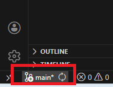
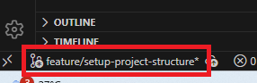
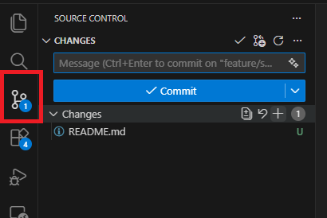
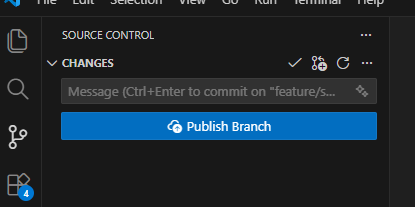
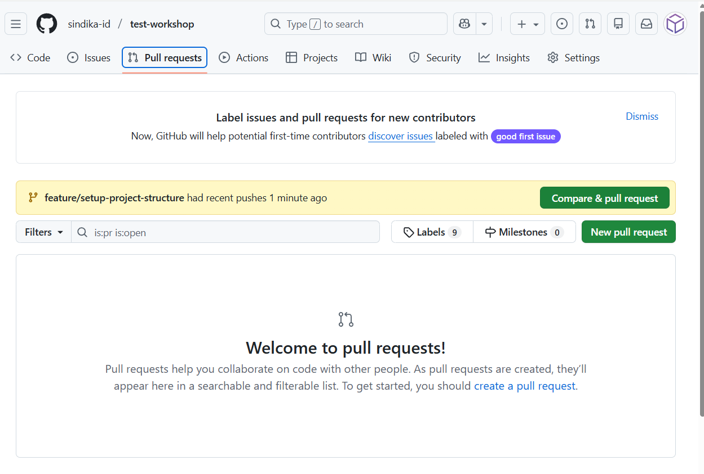
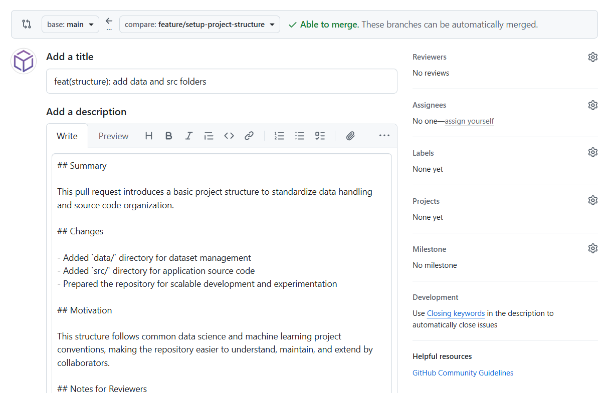
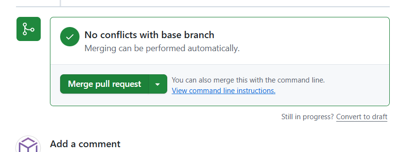

# Git Branching & Conventional Commit

## Tujuan Sesi
- Memahami kenapa branching penting dalam kolaborasi proyek data
- Memahami format dasar Conventional Commit
- Mampu menerapkan workflow sederhana: buat branch → commit → pull request → merge

---

## 1. Konsep Dasar Git Branching

Git Branching membantu anda:
- Mencoba fitur baru tanpa merusak `main`
- Memisahkan pekerjaan antar anggota tim
- Menjaga `main` selalu dalam kondisi stabil/siap rilis

### Conventional Branching

Beberapa pola nama branch yang umum:

- **Branch utama (stabil)**
  - `main` → kode yang sudah teruji dan siap dipakai
- **Branch fitur (feature branch)**
  - Prefix: `feature/`
  - Contoh: `feature/setup-kaggle-notebook`, `feature/add-eda-iris`
- **Branch perbaikan bug (bugfix branch)**
  - Prefix: `fix/`
  - Contoh: `fix/readme-typo`, `fix/eda-plot-error`
- **Branch eksperimen (opsional)**
  - Prefix: `experiment/`
  - Contoh: `experiment/new-model-test`

> 🎯 Prinsip: **jangan kerja langsung di `main`** untuk perubahan besar. Selalu lewat branch terpisah.

---


## 2. Membuat Repository di GitHub

1. Buka browser dan kunjungi: https://github.com
2. Login ke akun **GitHub**
3. Klik tombol **New repository** (ikon `+` di pojok kanan atas)

   

4. Isi informasi repository:
   - **Repository name**
   - **Visibility** – pilih **Public** atau **Private**
   - (Opsional) Centang **Add a README file**
5. Klik **Create repository**
   


## 3. Clone Repository ke Visual Studio Code

1. Buka **Visual Studio Code**
2. Buka **Source Control** pada sidebar
3. Pilih **Clone Repository**
   
4. Tempel **URL repository GitHub**.

   URL dapat disalin dari GitHub melalui menu **Code → Copy to clipboard**.

   
5. Pilih folder tujuan di komputer lokal
6. Klik **Open** ketika VS Code menanyakan apakah folder ingin dibuka

## 4. Praktik: Workflow Branching Sederhana

### Langkah 1: Buat Branch Baru

1. Pastikan anda sudah clone repositori ke lokal.

2. Perhatikan Status Bar di kiri bawah VS Code, klik nama branch saat ini (biasanya main).
  
3. Pilih Create new branch….

4. Masukkan nama branch, misalnya:
    ```
    feature/setup-project-structure
    ```
    
3. Sekarang semua perubahanmu akan tercatat di branch `feature/setup-project-structure`.
    
### Langkah 2: Lakukan Perubahan dan Commit

1. Edit struktur folder, notebook, atau README sesuai kebutuhan.
2. Cek status perubahan pada sidebar **Source Control**:

  

3. Tambahkan file yang ingin anda commit dengan klik tombol `+` ```stage all changes```:

    

4. Buat commit dengan pesan yang rapi (mengikuti Conventional Commit – dibahas di bawah):

5. Isi Commit Message pada input box, menggunakan format Conventional Commit, contoh:
  ```
  feat(structure): add data and src folders
  ```

### Langkah 3: Push Branch dan Membuat Pull Request

1. Setelah commit, Visual Studio Code akan menampilkan notifikasi bahwa branch belum dipush.
2. Klik **Publish Branch** atau **Sync Changes** untuk mengirim branch ke GitHub.

   

3. Setelah proses push berhasil, buka repository di GitHub melalui browser.
4. GitHub akan menampilkan tombol **Compare & pull request**.
    
5. Buat Pull Request dengan memperhatikan hal berikut:
   - **Judul** yang jelas dan deskriptif
   - **Deskripsi** singkat mengenai perubahan yang dilakukan

   

6. Setelah Pull Request direview dan disetujui, lakukan **Merge ke `main`** sesuai dengan prosedur tim.

   
   
---

## 5. Conventional Commit

Conventional Commit adalah **aturan penulisan pesan commit** agar konsisten dan mudah dibaca.

### Format Dasar

```text
<type>(optional-scope): <short description>
```

Contoh:

```text
feat(notebooks): add iris eda notebook
fix(readme): correct kaggle link
```

### Type yang Umum Dipakai

- `feat`   : menambah fitur baru
  - Contoh: `feat(structure): add src and reports folders`
- `fix`    : memperbaiki bug
  - Contoh: `fix(notebooks): handle empty dataset`
- `docs`   : perubahan dokumentasi saja
  - Contoh: `docs: update project structure section`
- `chore`  : pekerjaan rutin (config, tooling, dll.)
  - Contoh: `chore: update requirements.txt`
- `refactor`: merapikan kode tanpa mengubah perilaku
  - Contoh: `refactor: split eda into functions`

> 💡 Anda bisa menambah type lain (misal `test`, `style`) sesuai kebutuhan tim, yang penting konsisten.

### Tips Praktik Baik

- Gunakan deskripsi singkat (≤ 72 karakter) dan jelas.
- Satu commit untuk satu perubahan yang logis.
- Tulis dalam bahasa yang konsisten (Indonesia/Inggris, jangan campur dalam satu pesan).
- Pastikan pesan commit menjawab: *“Apa yang berubah?”* dan *“Mengapa?”* (jika perlu, tulis penjelasan lebih lengkap di body commit).