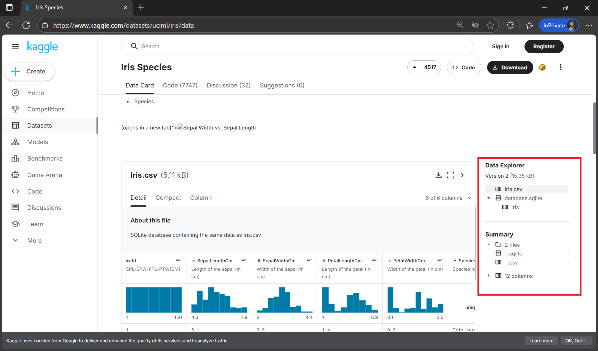

# Eksplorasi Dataset Terbuka: Iris Species

## Tujuan Sesi
- Mengenal dataset publik untuk analisis data
- Memahami struktur dan konteks dataset Iris
- Melakukan eksplorasi awal (preview, metadata, dan deskripsi)
- Menyiapkan dataset untuk digunakan di Kaggle Notebook & dokumentasi

---

## Apa Itu Dataset Iris?

Dataset **Iris** adalah salah satu dataset paling terkenal dalam dunia machine learning dan statistika, pertama kali diperkenalkan oleh **Ronald A. Fisher** pada tahun 1936.

- **Tujuan**: Mengklasifikasikan spesies bunga Iris berdasarkan dimensi kelopak dan sepal
- **Jumlah sampel**: 150 baris
- **Fitur**:
  - `sepal length` (cm)
  - `sepal width` (cm)
  - `petal length` (cm)
  - `petal width` (cm)
- **Target (label)**: `species` → terdiri dari:
  - `Iris-setosa`
  - `Iris-versicolor`
  - `Iris-virginica`

---

## Akses Dataset di Kaggle

🔗 **Link Dataset**: [https://www.kaggle.com/datasets/uciml/iris](https://www.kaggle.com/datasets/uciml/iris)

### Langkah-langkah Eksplorasi Awal

1. **Buka halaman dataset**  
   - Lihat deskripsi: konteks, sumber, dan atribusi
   - Perhatikan lisensi (biasanya **Public Domain** atau **CC0** – bebas digunakan)


2. **Lihat file yang tersedia**
   - `Iris.csv` → file utama (150 baris, 6 kolom termasuk `Id`)
   - `database.sqlite` → versi alternatif (tidak perlu digunakan untuk sesi ini)


3. **Preview data langsung di browser**  
   Kaggle menampilkan 100 baris pertama dalam bentuk tabel interaktif


4. **Baca metadata & diskusi (opsional)**  
   - Tab **Discussion**: lihat pertanyaan umum atau insight dari komunitas
   - Tab **Code**: lihat notebook lain yang menggunakan dataset ini


---

## Integrasi ke Struktur Proyek

Meski data tidak disimpan di GitHub (karena ukuran & lisensi), dokumentasikan:
- Nama dataset
- Link sumber
- Versi (jika ada)
- Ringkasan fitur

Contoh isi `README.md` (bagian Dataset):
```markdown
## Dataset
- **Nama**: Iris Species  
- **Sumber**: [UCI ML Repository via Kaggle](https://www.kaggle.com/datasets/uciml/iris)  
- **Lisensi**: Public Domain  
- **Deskripsi**: Dataset klasifikasi 3 spesies bunga Iris berdasarkan 4 fitur morfologis.
```
