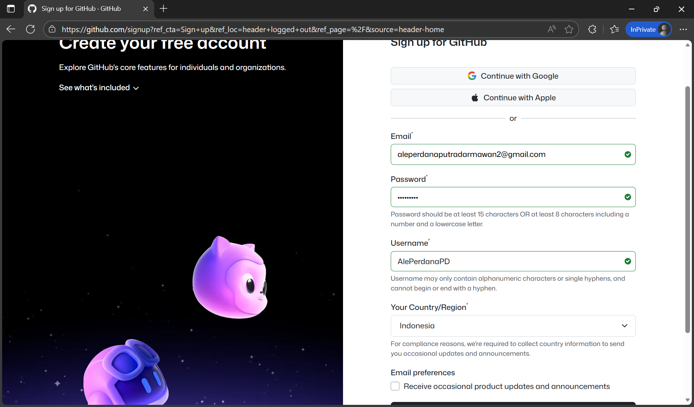
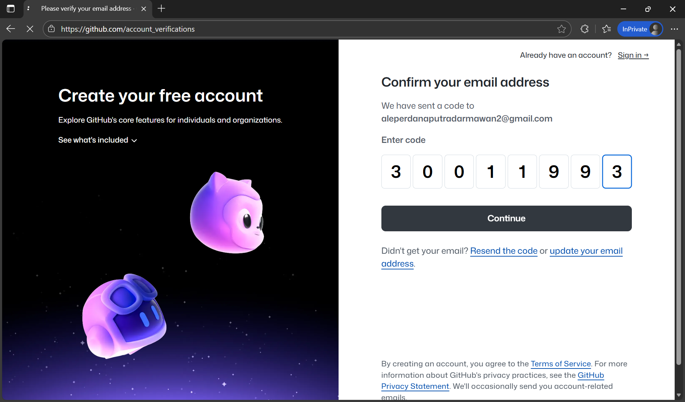
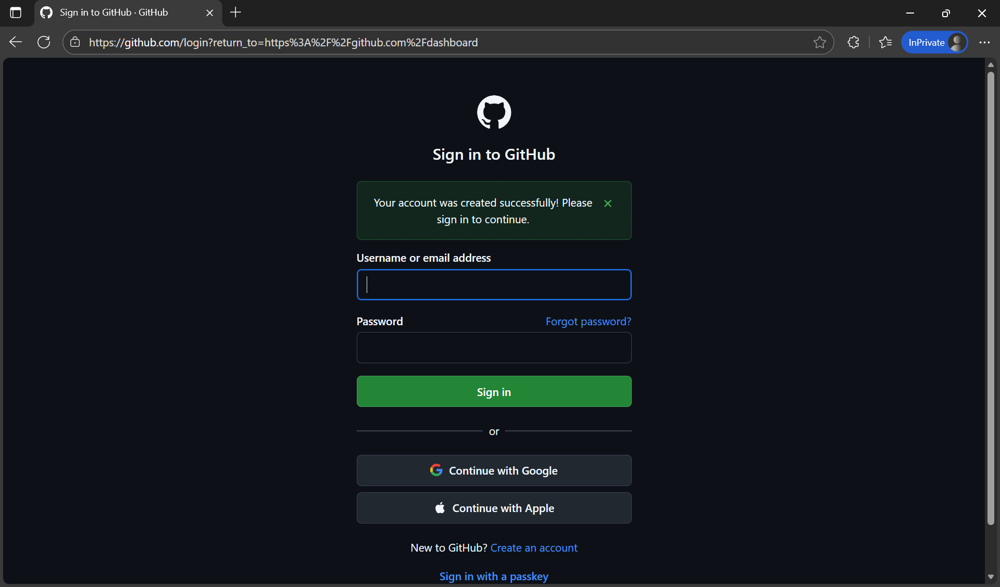
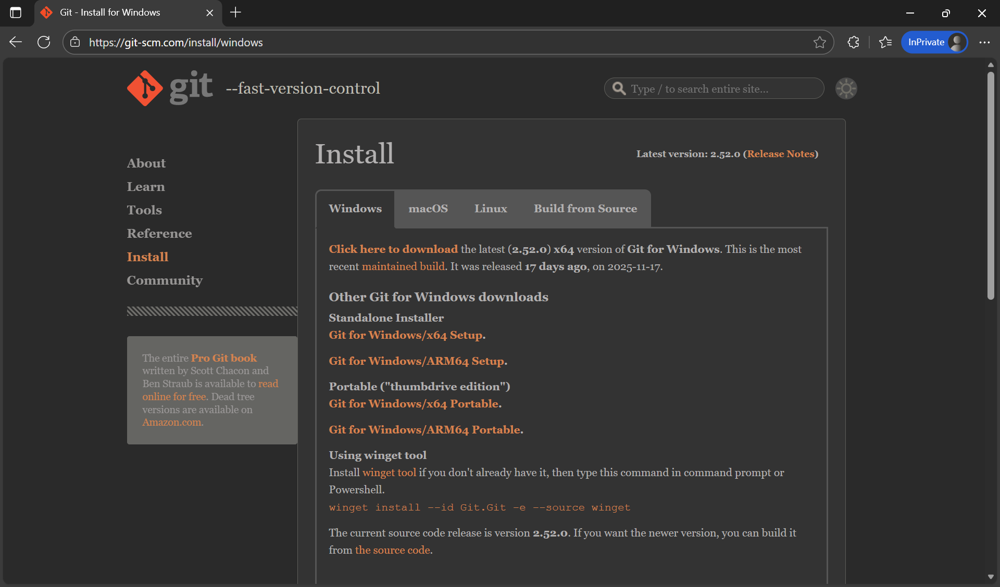
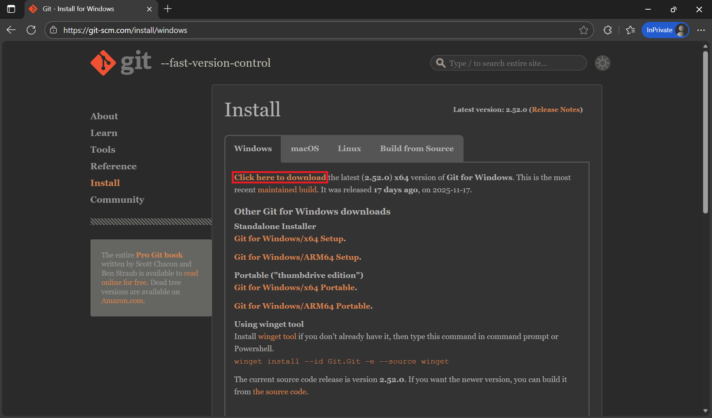
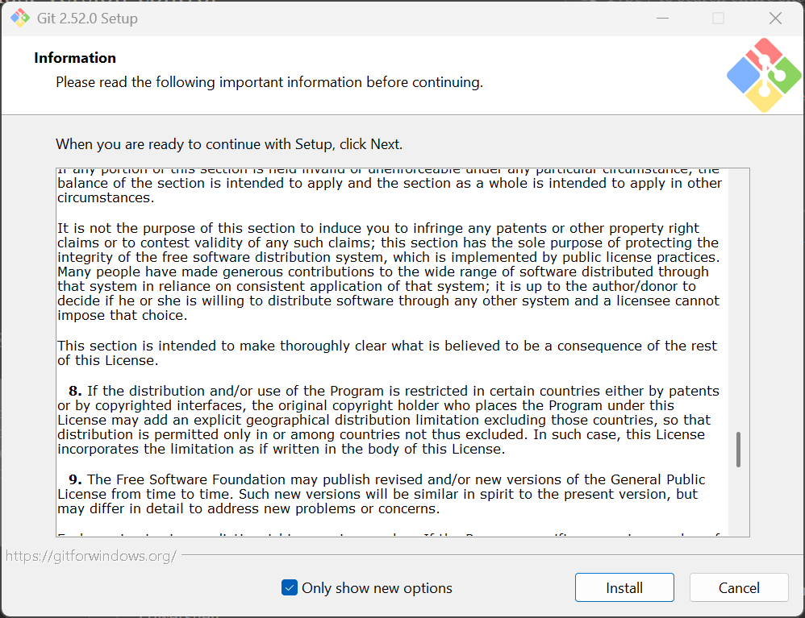
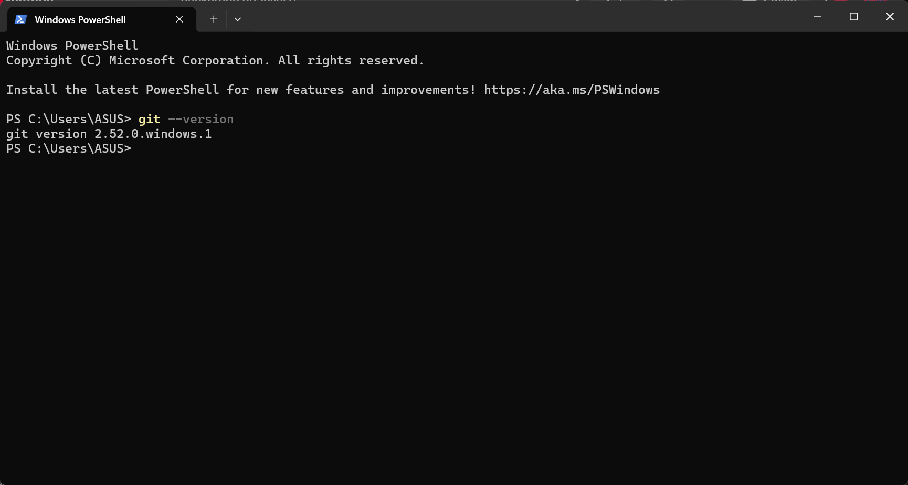
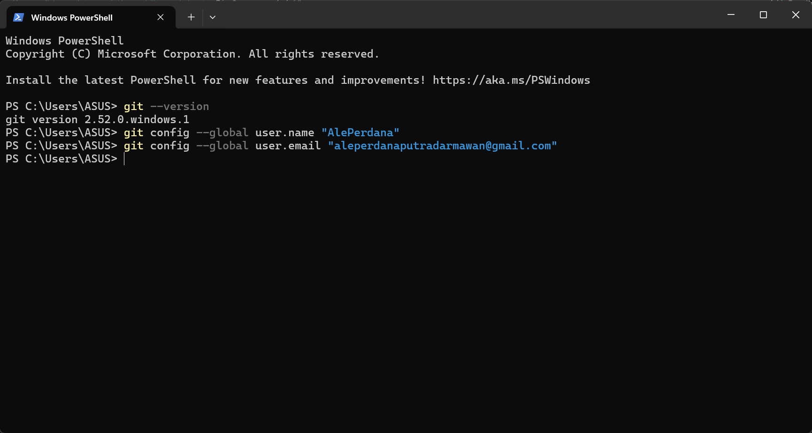
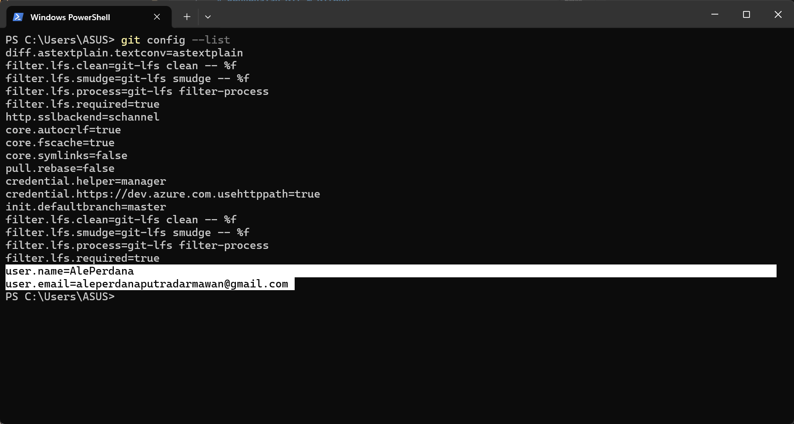

# Pengenalan Git & GitHub

## Tujuan Pembelajaran
- Memahami perbedaan antara Git dan GitHub
- Mengetahui manfaat Git dalam kolaborasi proyek data
- Mampu membuat akun GitHub
- Mampu menginstal Git di sistem operasi (Windows, macOS, Linux)
- Memahami konsep dasar version control

---

## Apa Itu Git dan GitHub?

### Git
Git adalah **sistem kontrol versi terdistribusi** (distributed version control system) yang memungkinkan:
- Melacak perubahan pada file (terutama kode dan dokumen teknis)
- Bekerja secara kolaboratif tanpa menimpa pekerjaan orang lain
- Kembali ke versi sebelumnya jika terjadi kesalahan

Git bekerja **lokal** di komputer Anda.

### GitHub
GitHub adalah **platform berbasis cloud** yang meng-host repositori Git secara online. Fitur utamanya:
- Kolaborasi tim melalui pull request, issue, dan diskusi
- Backup dan sharing kode/proyek
- Integrasi dengan berbagai tools (CI/CD, project board, dll)

> 💡 **Analogi**:  
> Git = Mesin pencatat sejarah perubahan (seperti "track changes" di Word)  
> GitHub = Google Drive untuk proyek Git

---

## Langkah 1: Daftar Akun GitHub

1. Buka [https://github.com] dan Klik tombol **Sign up**(https://github.com)


2. Isi:
   - Username
   - Email (gunakan email yang aktif)
   - Password


3. Verifikasi CAPTCHA, lalu klik **Continue**


4. Selesai! Anda sekarang memiliki akun GitHub


> ✅ Tips:  
> - Pilih username profesional (hindari angka acak)  
> - Aktifkan two-factor authentication (2FA) untuk keamanan tambahan


---

## Langkah 2: Instal Git

### 🪟 Windows

1. Kunjungi [https://git-scm.com/download/win](https://git-scm.com/download/win)


2. Unduh installer terbaru


3. Jalankan file `.exe` dan ikuti petunjuk instalasi (gunakan pengaturan default)


4. Setelah selesai, buka **Command Prompt** atau **Git Bash**, lalu ketik:
   ```bash
   git --version
   ```
   Jika muncul versi (misal: `git version 2.40.1.windows.1`), instalasi berhasil.


### 🍏 macOS

#### Opsi A: Instal via Homebrew (disarankan jika sudah punya Homebrew)
```bash
brew install git
```

#### Opsi B: Unduh langsung
1. Kunjungi [https://git-scm.com/download/mac](https://git-scm.com/download/mac)
2. Unduh file `.dmg`
3. Buka dan ikuti proses instalasi
4. Buka **Terminal**, lalu cek versi:
   ```bash
   git --version
   ```

> Catatan: Jika muncul notifikasi instalasi command-line developer tools, izinkan saja.

### 🐧 Linux (Ubuntu/Debian)

Buka terminal dan jalankan:
```bash
sudo apt update
sudo apt install git -y
```

Untuk distribusi lain:
- **Fedora**: `sudo dnf install git`
- **Arch**: `sudo pacman -S git`

Lalu cek versi:
```bash
git --version
```

---

## Konfigurasi Awal Git

Setelah instalasi, atur identitas global Anda (cukup sekali):

```bash
git config --global user.name "Nama Anda"
git config --global user.email "email@anda.com"
```

> ⚠️ Pastikan email **sama** dengan yang digunakan di GitHub agar kontribusi terdeteksi



---

## Langkah 3: Cek Instalasi

Buka terminal/Git Bash, lalu jalankan:
```bash
git config --list
```
Anda akan melihat daftar konfigurasi, termasuk `user.name` dan `user.email`.

