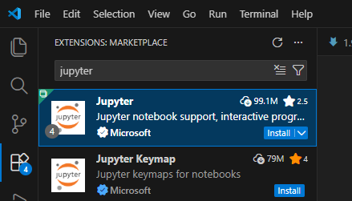
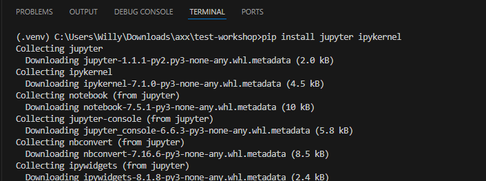
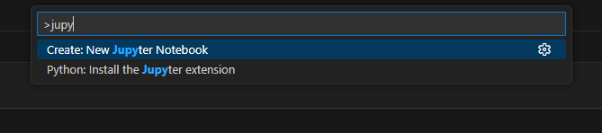
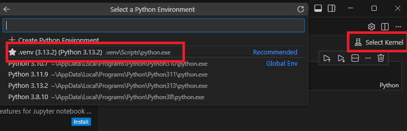
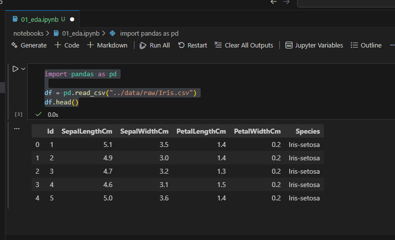

# Menjalankan Jupyter Notebook di Visual Studio Code

## Tujuan Sesi
- Memahami cara menjalankan Jupyter Notebook secara resmi di VS Code
- Mampu membuat dan membuka notebook di VS Code
- Mampu memilih kernel Python yang tepat dari virtual environment
- Mampu menjalankan cell notebook dengan shortcut dan mengerti outputnya
- Memahami best practices struktur proyek untuk notebook

---

Dokumen ini menjelaskan **cara menjalankan Jupyter Notebook di Visual Studio Code (VS Code)** secara **resmi, stabil, dan direkomendasikan** untuk kebutuhan data science, machine learning, dan analisis data.

---

## 1. Prasyarat

Pastikan komponen berikut sudah terpasang:

- **Python 3.8 atau lebih baru**
- **Visual Studio Code**
- **Git** (opsional, direkomendasikan)

### Ekstensi VS Code yang Wajib
Pasang ekstensi resmi berikut:
- **Python** (by Microsoft)
- **Jupyter** (by Microsoft)

   

---

## 2. Membuat dan Mengaktifkan Virtual Environment (Direkomendasikan)

Virtual environment digunakan untuk memisahkan dependensi tiap proyek.
> 📌 **Catatan**  
> Panduan lengkap pembuatan dan aktivasi virtual environment dengan Visual Studio Code
> dapat dilihat pada dokumen berikut:  
> **[1.9 Membuat Virtual Environment dengan VS Code](./1.9%20Membuat%20Virtual%20Environment%20dengan%20VS%20Code.md)**

---

## 3. Menginstal Jupyter dan Kernel

Setelah virtual environment aktif, jalankan perintah berikut:

```bash
pip install --upgrade pip
pip install jupyter ipykernel
```




---

## 4. Membuka atau Membuat Jupyter Notebook di VS Code

### Opsi A: Membuat Notebook Baru
1. Tekan `Ctrl + Shift + P`
2. Pilih **Jupyter: Create New Blank Notebook**
3. Pilih **Python Kernel**

    


### Opsi B: Membuka Notebook yang Sudah Ada
- Buka file dengan ekstensi `.ipynb` langsung di VS Code


## 5. Memilih Python Kernel

Pastikan notebook menggunakan Python dari virtual environment:

1. Klik **Kernel Picker** di kanan atas notebook
2. Pilih:
   ```
   Python (.venv)
   ```
3. Jika tidak muncul:
   - Pilih **Select Kernel → Python Environments**
   - Pilih interpreter dari folder `.venv`

    
---

## 6. Menjalankan Cell Notebook

### Shortcut Umum
- `Shift + Enter` → Jalankan cell dan pindah ke bawah
- `Ctrl + Enter` → Jalankan cell tanpa pindah
- `Run → Run All Cells` → Menjalankan seluruh notebook


### Contoh Cell
```python
import pandas as pd

df = pd.read_csv("../data/raw/Iris.csv")
df.head()
```

---

## 7. Struktur Proyek yang Direkomendasikan

```text
project/
├── notebooks/
│   ├── 01_eda.ipynb
│   └── 02_training.ipynb
├── src/
│   ├── data/
│   ├── models/
│   └── utils/
├── data/
├── .venv/
├── requirements.txt
└── README.md
```

**Best practice:** Notebook digunakan untuk eksplorasi dan analisis, sedangkan logika utama ditempatkan di folder `src/`.

---

## 8. Troubleshooting Umum

### Kernel Tidak Muncul
```bash
python -m ipykernel install --user --name .venv
```

### Cell Tidak Bisa Dijalankan
Pastikan:
- Ekstensi Python dan Jupyter aktif
- Kernel yang benar sudah dipilih
- Virtual environment aktif
- Coba **Restart Kernel** jika diperlukan

---

## 9. Best Practices Profesional

- Gunakan satu virtual environment untuk satu proyek
- Hindari commit notebook dengan output besar
- Simpan model di folder `models_artifacts/`
- Kelola dependensi dengan `requirements.txt`

---

## 10. Menjalankan Jupyter dari Terminal (Opsional)

```bash
jupyter notebook
```

atau

```bash
jupyter lab
```