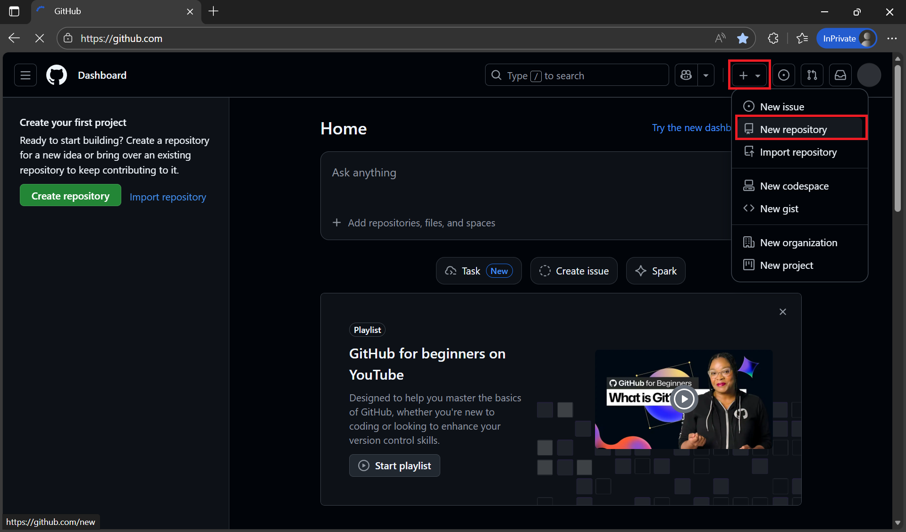
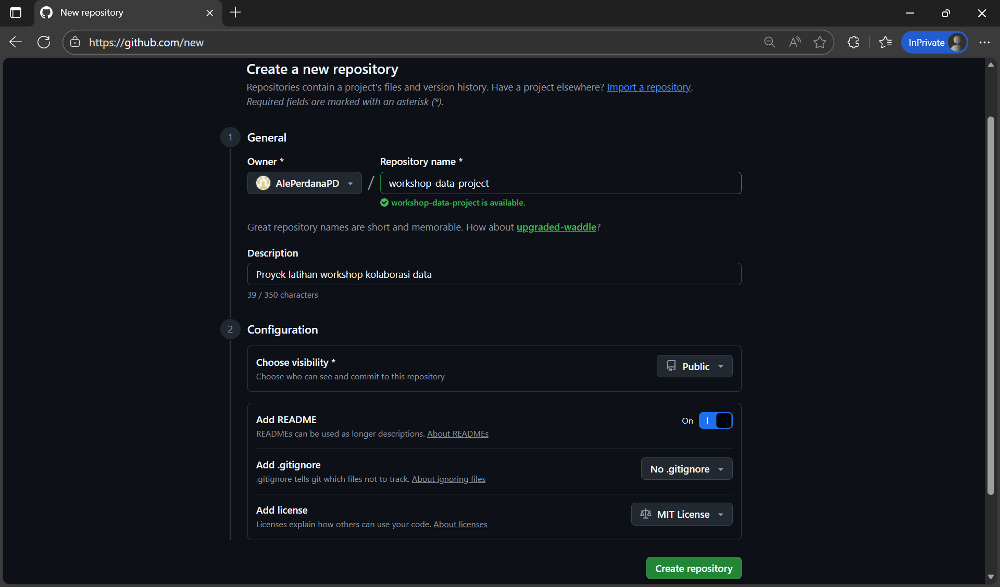
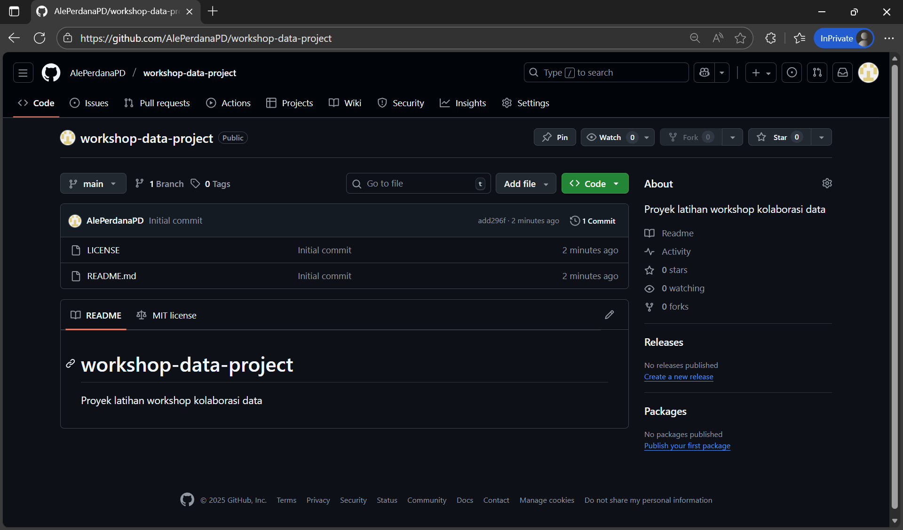
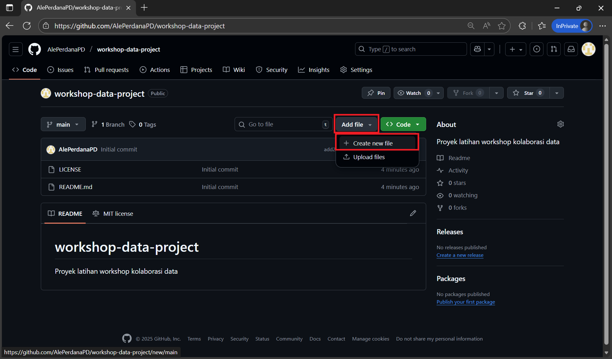
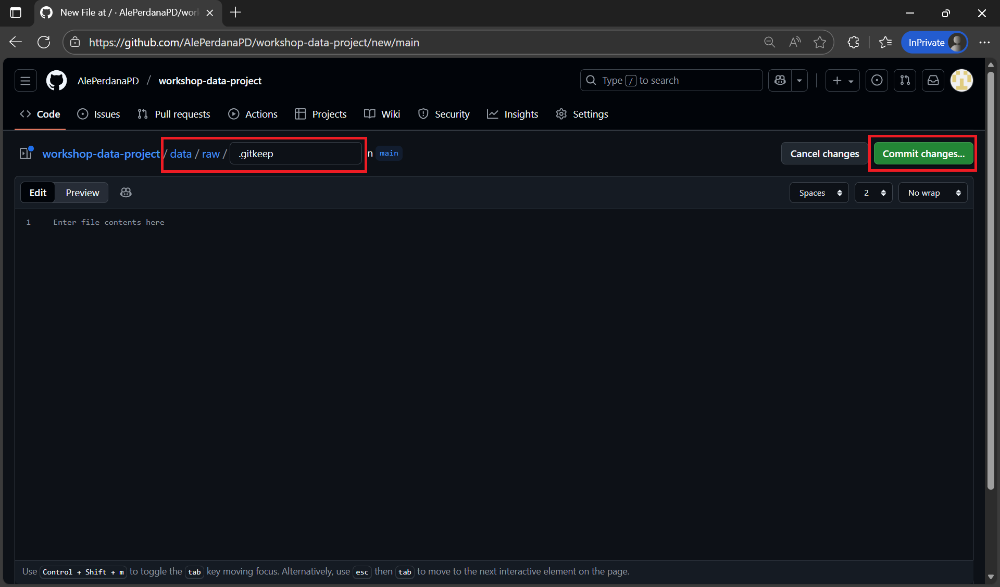
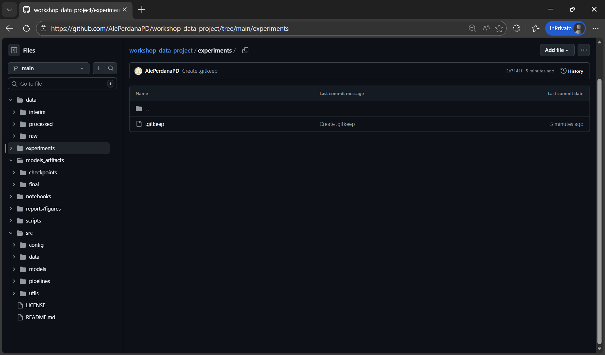
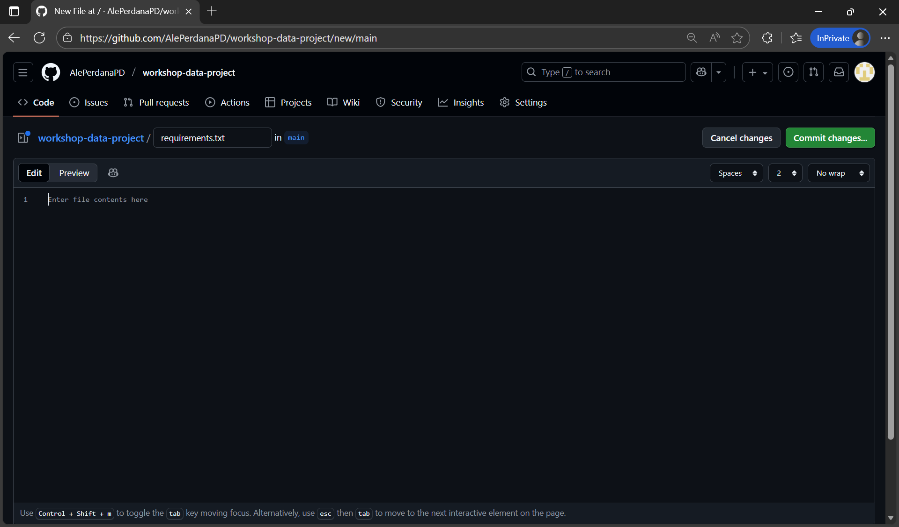
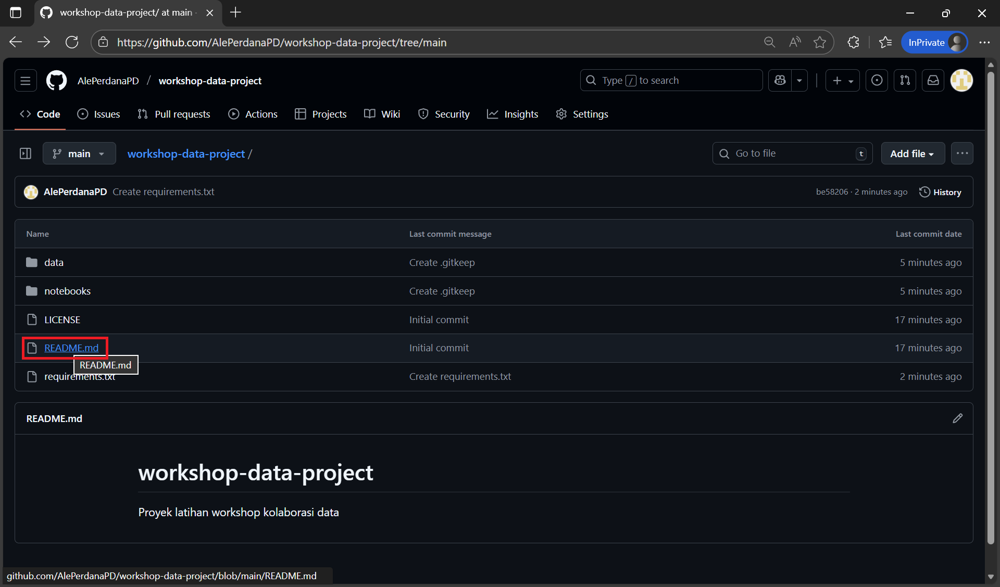
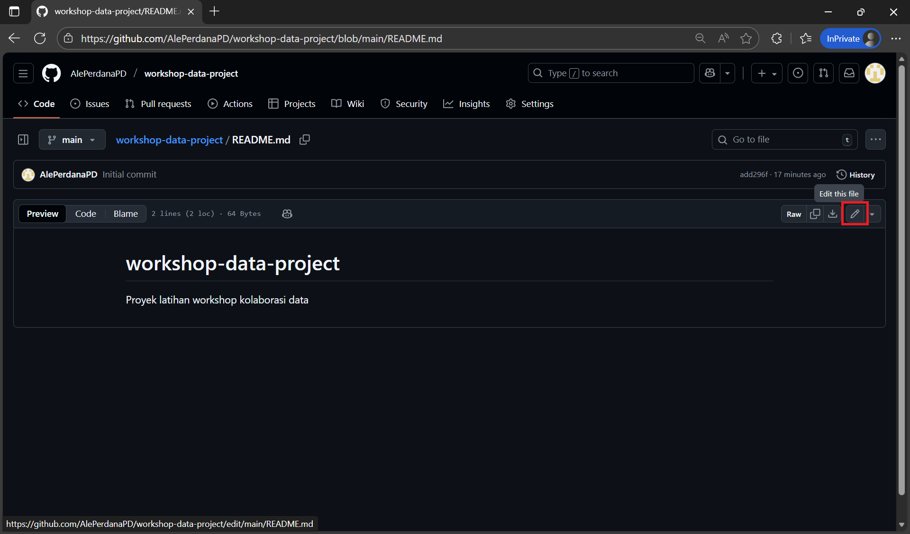
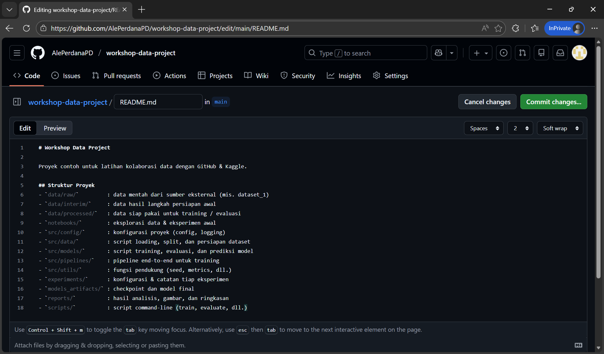

# Struktur Proyek Data yang Kolaboratif

## Tujuan Sesi
- Memahami pentingnya struktur proyek yang konsisten dalam kolaborasi data
- Membangun fondasi direktori yang jelas dan terdokumentasi
- Menyiapkan template awal repository GitHub yang siap digunakan bersama tim

---

## Mengapa Struktur Proyek Penting?

Dalam dunia data, proyek sering melibatkan:
- Banyak file (data mentah, script, notebook, output)
- Banyak orang (analyst, engineer, scientist, stakeholder)
- Banyak iterasi (eksperimen, revisi, deployment)

Tanpa struktur yang jelas, proyek bisa menjadi:
- Sulit dipahami oleh anggota baru
- Rentan terhadap duplikasi atau kehilangan file
- Tidak reproducible atau tidak terdokumentasi dengan baik

> ✨ Prinsip utama: **"Siapa pun harus bisa masuk ke repositori ini dan paham dalam 5 menit."**

---

## Template Struktur Proyek Data

Berikut adalah struktur standar yang direkomendasikan untuk proyek data kolaboratif:

```
nama-proyek/
│
├── README.md
├── LICENSE
├── .gitignore
├── .env.example
├── requirements.txt
│
├── data/
│   ├── raw/
│   │   └── dataset_1/
│   │       ├── dataset_1_metadata.csv
│   │       ├── dataset_1_images_part_1/
│   │       └── dataset_1_images_part_2/
│   ├── interim/
│   └── processed/
│
├── notebooks/
│   ├── 01_eda.ipynb
│   ├── 02_prepare_split.ipynb
│   └── 03_train_baseline.ipynb
│
├── src/
│   ├── config/
│   │   ├── config.yaml
│   │   └── logging.yaml
│   │
│   ├── data/
│   │   ├── load.py
│   │   ├── split.py
│   │   └── prepare_dataset.py
│   │
│   ├── models/
│   │   ├── train.py
│   │   ├── evaluate.py
│   │   └── predict.py
│   │
│   ├── pipelines/
│   │   └── training_pipeline.py
│   │
│   └── utils/
│       ├── seed.py
│       └── metrics.py
│
├── experiments/
│   └── exp_001_baseline/
│       ├── config.yaml
│       └── notes.md
│
├── models_artifacts/
│   ├── checkpoints/
│   └── final/
│
├── reports/
│   ├── figures/
│   └── results.md
│
└── scripts/
   ├── train.sh
   └── evaluate.sh
```

> 📌 **Catatan**:  
> - Jangan menyimpan data sensitif, password, atau file berukuran sangat besar di Git.  
> - Untuk dataset besar, cukup simpan **link** ke Kaggle Dataset atau sumber eksternal.  
> - Di workshop ini, kita akan memulai dari versi **sederhana** (hanya beberapa folder utama), lalu bertahap memahami struktur lengkap seperti di atas.

---

## Praktik: Membuat Struktur Proyek Pertama

### Langkah 1: Buat Repository Baru di GitHub
1. Masuk ke [github.com](https://github.com)
2. Klik **New repository**


3. Isi:
   - Nama: `workshop-data-project`
   - Deskripsi: "Proyek latihan workshop kolaborasi data"
   - Centang **Add a README file**
   - Pilih lisensi (misal: MIT License)
> 💡 **MIT License (singkatnya)**: lisensi open source yang sangat permisif — anda boleh menggunakan, menyalin, memodifikasi, dan mendistribusikan ulang kode (termasuk untuk keperluan komersial), selama tetap mencantumkan copyright
> dan teks lisensinya, serta pembuat tidak memberikan jaminan/garansi apa pun ("AS IS").

4. Klik **Create repository**


5. Repository sudah berhasil dibuat!



---

### Langkah 2: Tambahkan Struktur Dasar
Gunakan GitHub UI untuk mulai membangun struktur proyek sesuai **template struktur** di atas:

1. Klik tombol **Add file → Create new file**


2. Buat folder `data/raw/` dengan file `.gitkeep`
   - Di bagian `Name your file...`, ketik: `data/raw/.gitkeep`
   - Ini akan otomatis membuat folder `data` dan subfolder `raw` dengan file `.gitkeep`
   - Lalu klik tombol **Commit Changes...** untuk membuat folder dan file tersebut.


3. Ulangi pola yang sama untuk membuat folder penting lainnya:
   - `data/interim/.gitkeep`
   - `data/processed/.gitkeep`
   - `notebooks/.gitkeep`
   - `src/config/.gitkeep`
   - `src/data/.gitkeep`
   - `src/models/.gitkeep`
   - `src/pipelines/.gitkeep`
   - `src/utils/.gitkeep`
   - `experiments/.gitkeep`
   - `models_artifacts/checkpoints/.gitkeep`
   - `models_artifacts/final/.gitkeep`
   - `reports/figures/.gitkeep`
   - `scripts/.gitkeep`


1. Buat file:
   - `requirements.txt` (kosong dulu)


> 🔍 `.gitkeep` adalah trik agar folder kosong tetap terkirim ke Git (karena Git tidak melacak folder kosong).

---

### Langkah 3: Edit `README.md`

1. Klik file **README.md** untuk membukanya


2. Klik tombol **pencil (edit)** untuk mulai mengedit


3. Gantikan isi `README.md` dengan:

```markdown
# Workshop Data Project

Proyek contoh untuk latihan kolaborasi data dengan GitHub & Kaggle.

## Struktur Proyek
- `data/raw/`         : data mentah dari sumber eksternal (mis. dataset_1)
- `data/interim/`     : data hasil langkah persiapan awal
- `data/processed/`   : data siap pakai untuk training / evaluasi
- `notebooks/`        : eksplorasi data & eksperimen awal
- `src/config/`       : konfigurasi proyek (config, logging)
- `src/data/`         : script loading, split, dan persiapan dataset
- `src/models/`       : script training, evaluasi, dan prediksi model
- `src/pipelines/`    : pipeline end-to-end untuk training
- `src/utils/`        : fungsi pendukung (seed, metrics, dll.)
- `experiments/`      : konfigurasi & catatan tiap eksperimen
- `models_artifacts/` : checkpoint dan model final
- `reports/`          : hasil analisis, gambar, dan ringkasan
- `scripts/`          : script command-line (train, evaluate, dll.)
```

4. Klik **Commit changes...** untuk menyimpan perubahan


---

## Best Practices Struktur Proyek
✅ Gunakan nama file yang deskriptif (`01-iris-eda.ipynb`, bukan `iris_eda_v1.ipynb`)  
✅ Tulis README sejak awal — jangan ditunda!  
✅ Pisahkan **data mentah** dan **data hasil olahan**  
✅ Gunakan versi notebook yang ringkas dan fokus

