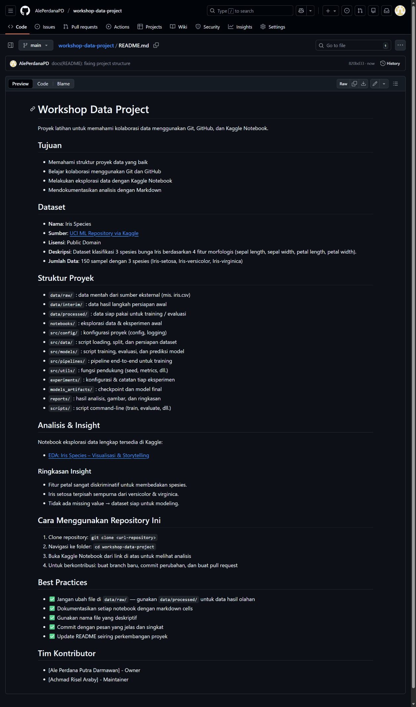

# Dokumentasi Dasar dengan Markdown

## Tujuan Sesi
- Memahami peran dokumentasi dalam proyek data kolaboratif  
- Menguasai sintaks dasar Markdown untuk menulis README dan catatan proyek  
- Mampu membuat file `README.md` yang informatif dan terstruktur  

---

## Apa Itu Markdown?

**Markdown** adalah bahasa markup ringan yang:
- Mudah ditulis dan dibaca (plain text)
- Dapat diubah menjadi HTML secara otomatis
- Digunakan secara luas di GitHub, Kaggle, dan platform dokumentasi

> ✨ Keunggulan untuk proyek data:  
> - Dokumentasi bisa disimpan di repositori yang sama dengan kode  
> - Versi terkendali (version-controlled) seperti file lainnya  
> - Render otomatis di GitHub sebagai halaman web cantik

---

## Sintaks Dasar Markdown

### 1. Judul
```markdown
# Judul Utama (H1)
## Subjudul (H2)
### Sub-subjudul (H3)
```

### 2. Paragraf & Pemformatan
```markdown
Ini adalah paragraf biasa.

**Tebal** → **Tebal**  
*Miring* → *Miring*  
`inline code` → `inline code`
```

### 3. Daftar
**Daftar tak berurut:**
```markdown
- Item 1
- Item 2
  - Sub-item
```

**Daftar berurut:**
```markdown
1. Langkah pertama
2. Langkah kedua
```

### 4. Link & Gambar
```markdown
[Link ke Kaggle](https://www.kaggle.com)


```
> 💡 Untuk gambar di GitHub: unggah file ke repositori, lalu gunakan path relatif (misal: `images/flow.png`)

### 5. Blok Kode
**Inline:**  
Gunakan backtick: `` `print("hello")` ``

**Blok kode dengan syntax highlighting:**
````markdown
```python
import pandas as pd
df = pd.read_csv("data.csv")
```
````

### 6. Tabel
```markdown
| Fitur         | Tipe Data |
|---------------|-----------|
| sepal_length  | float64   |
| species       | object    |
```

### 7. Kutipan
```markdown
> Ini adalah kutipan atau catatan penting.
```

---

## Latihan: Buat README.md untuk Proyek Anda

Buat file `README.md` di root repository dengan struktur berikut:

```markdown
# Nama Proyek Data

Deskripsi singkat proyek (1–2 kalimat).

## Tujuan
- Menjelaskan tujuan analisis
- Menyebutkan pertanyaan bisnis/riset

## Dataset
- **Nama**: Iris Species  
- **Sumber**: [UCI ML Repository via Kaggle](https://www.kaggle.com/datasets/uciml/iris)  
- **Lisensi**: Public Domain  
- **Deskripsi**: Dataset klasifikasi 3 spesies bunga Iris berdasarkan 4 fitur morfologis.

## Struktur Proyek
- `data/raw/`         : data mentah dari sumber eksternal (mis. iris.csv)
- `data/interim/`     : data hasil langkah persiapan awal
- `data/processed/`   : data siap pakai untuk training / evaluasi
- `notebooks/`        : eksplorasi data & eksperimen awal
- `src/config/`       : konfigurasi proyek (config, logging)
- `src/data/`         : script loading, split, dan persiapan dataset
- `src/models/`       : script training, evaluasi, dan prediksi model
- `src/pipelines/`    : pipeline end-to-end untuk training
- `src/utils/`        : fungsi pendukung (seed, metrics, dll.)
- `experiments/`      : konfigurasi & catatan tiap eksperimen
- `models_artifacts/` : checkpoint dan model final
- `reports/`          : hasil analisis, gambar, dan ringkasan
- `scripts/`          : script command-line (train, evaluate, dll.)

## Analisis
- [Notebook EDA di Kaggle](https://www.kaggle.com/username/notebook-name)
```

> ✅ Simpan file **README.md** di GitHub — akan otomatis muncul sebagai halaman utama repositori!


---

## Best Practices Penulisan README
- Gunakan **bahasa jelas dan ringkas**
- Sertakan **link aktif** ke notebook, dataset, atau dokumen pendukung
- Jelaskan **cara menjalankan** atau **memahami** proyek dalam 2 menit
- Update README seiring perkembangan proyek