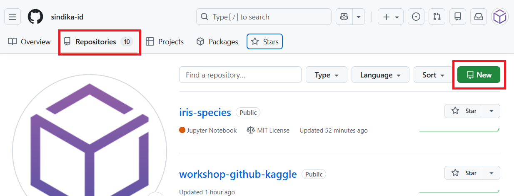
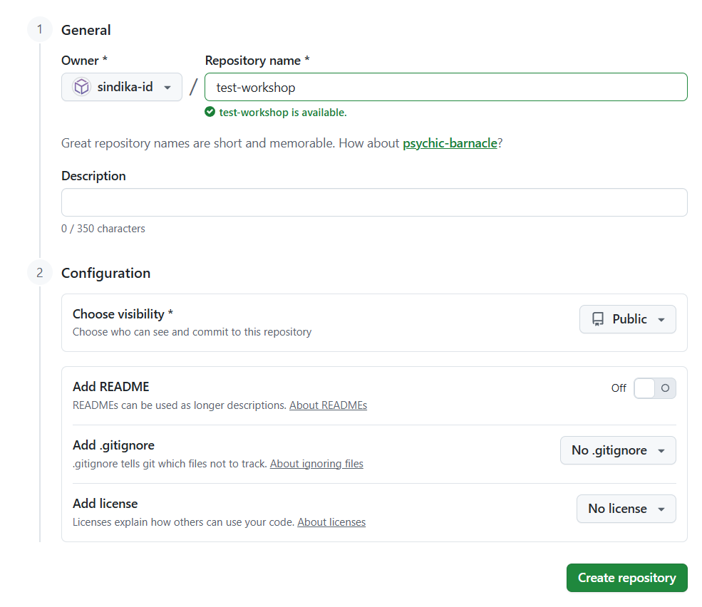
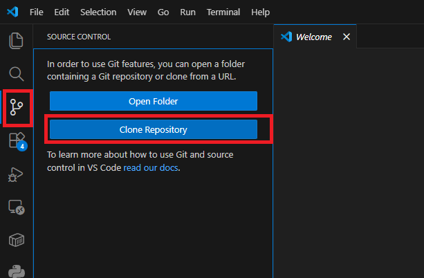
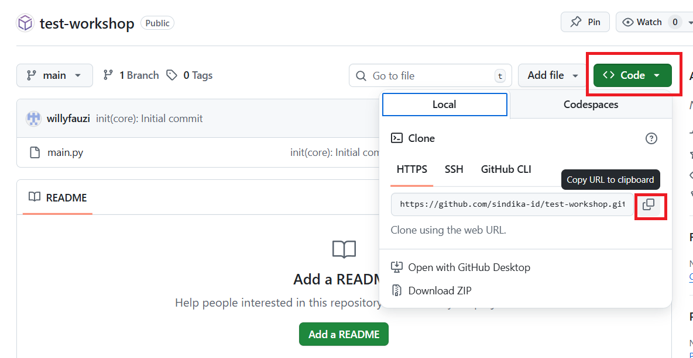
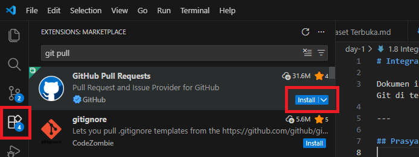
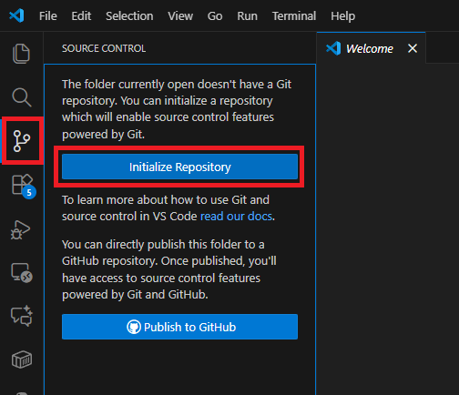
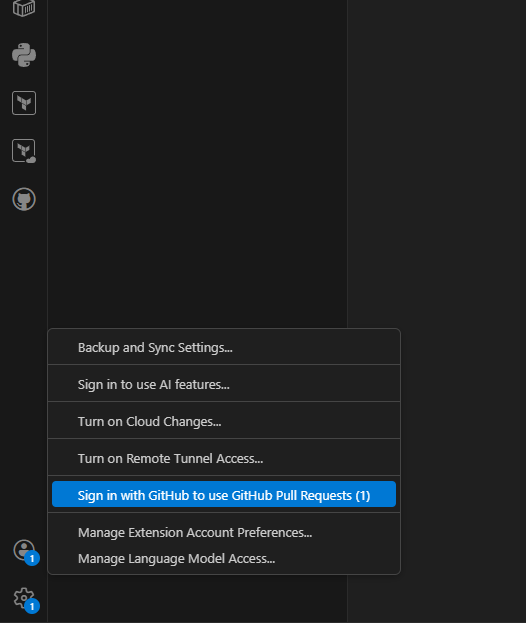
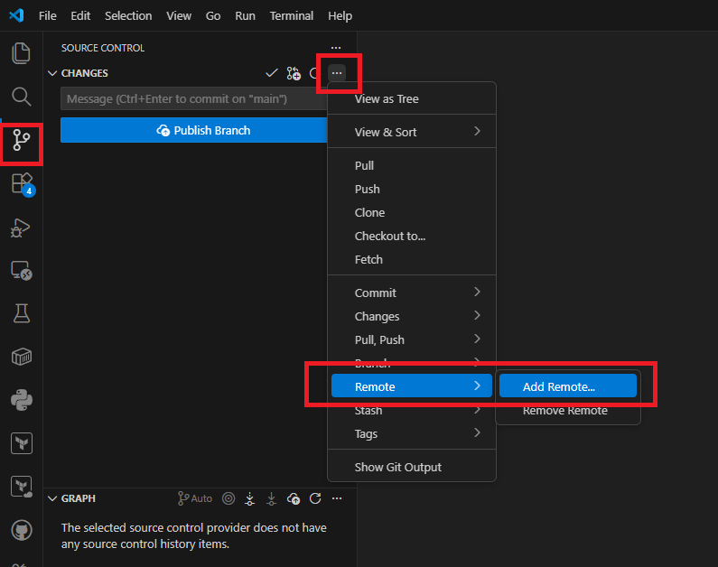
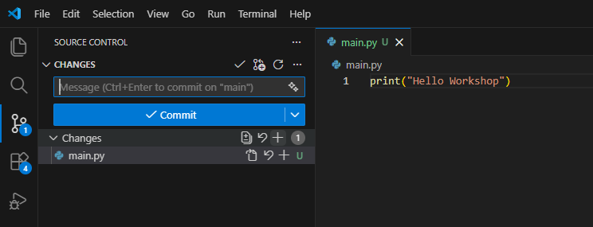
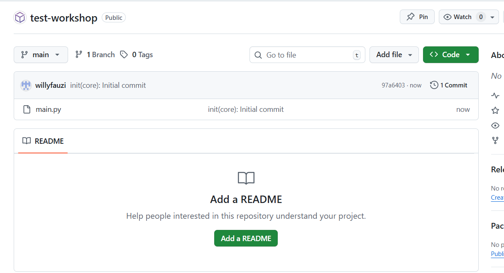

# Integrasi Visual Studio Code dengan GitHub 

Dokumen ini menjelaskan cara **mengintegrasikan Visual Studio Code (VS Code) dengan GitHub** menggunakan **antarmuka grafis (GUI)**, tanpa perlu menggunakan perintah Git di terminal.

---

## Prasyarat

Pastikan Anda sudah memiliki:

- **Visual Studio Code** terinstal
- **Akun GitHub**
- **Git** terinstal di komputer  
  Unduh dari: https://git-scm.com
- Koneksi internet

---
## Pendekatan Integrasi Repository GitHub dan VS Code

Terdapat **dua cara umum** untuk mengintegrasikan proyek di **Visual Studio Code** dengan **GitHub**.
Keduanya valid dan sering digunakan, tergantung pada kondisi proyek Anda.

### Cara 1: Membuat Repository di GitHub Terlebih Dahulu, Lalu Clone ke VS Code (Direkomendasikan)

Ini adalah **cara paling mudah dan paling aman**, terutama untuk:
- Pemula
- Praktikum
- Proyek baru
- Menghindari konflik sinkronisasi

**Alur singkat:**
1. Buat repository terlebih dahulu di website GitHub
2. Clone repository tersebut ke komputer lokal menggunakan VS Code
3. Mulai bekerja dan melakukan commit dari VS Code

**Kelebihan:**
- Minim kesalahan konfigurasi
- Remote repository sudah tersedia sejak awal
- Alur kerja lebih sederhana dan stabil

> Cara ini sangat disarankan jika proyek **belum ada** di komputer lokal.

---

### Cara 2: Proyek Sudah Ada di Lokal, Lalu Disinkronkan ke GitHub

Cara ini digunakan jika:
- Proyek sudah terlanjur dibuat di komputer lokal
- Repository Git lokal sudah ada
- Ingin mengunggah proyek tersebut ke GitHub sebagai remote repository

**Alur singkat:**
1. Inisialisasi Git repository di VS Code
2. Buat repository baru di GitHub (tanpa file)
3. Hubungkan repository lokal ke GitHub sebagai remote (`origin`)
4. Lakukan commit dan push ke GitHub

**Catatan:**
- Perlu perhatian ekstra saat menghubungkan remote
- Pastikan tidak terjadi konflik file (misalnya README ganda)

> Cara ini cocok untuk proyek yang **sudah berjalan** sebelum menggunakan GitHub.

----
# Cara 1 : Membuat Repository di GitHub Terlebih Dahulu, Lalu Clone ke VS Code
----

### Langkah 1: Membuat Repository di GitHub

1. Buka browser dan kunjungi: https://github.com
2. Login ke akun **GitHub**
3. Klik tombol **New repository** (ikon `+` di pojok kanan atas)

   

4. Isi informasi repository:
   - **Repository name**
   - **Visibility** – pilih **Public** atau **Private**
   - (Opsional) Centang **Add a README file**
5. Klik **Create repository**
   

---

### Langkah 2: Clone Repository ke Visual Studio Code

1. Buka **Visual Studio Code**
2. Buka **Source Control** pada sidebar
3. Pilih **Clone Repository**
   
4. Tempel **URL repository GitHub**.

   URL dapat disalin dari GitHub melalui menu **Code → Copy to clipboard**.

   
5. Pilih folder tujuan di komputer lokal
6. Klik **Open** ketika VS Code menanyakan apakah folder ingin dibuka

---

### Langkah 3: Mulai Bekerja di VS Code

Setelah proses clone selesai:

- Repository GitHub sudah otomatis terhubung sebagai **remote (`origin`)**
- Anda bisa langsung:
  - Menambahkan file
  - Stage perubahan
  - Commit
  - Push ke GitHub

Tidak diperlukan konfigurasi remote tambahan.

----
# Cara 2 : Proyek Sudah Ada di Lokal, Lalu Disinkronkan ke GitHub
----

## Langkah 1: Install Ekstensi GitHub di VS Code

1. Buka **Visual Studio Code**
2. Klik menu **Extensions** (ikon kotak di sidebar kiri)
3. Cari dan install:
   - **GitHub Pull Requests and Issues** (by GitHub)

   

---

## Langkah 2: Buka Folder Proyek

1. Klik **File → Open Folder…**
2. Pilih folder proyek Anda
3. Klik **Select Folder**

---

## Langkah 3: Inisialisasi Repository Git (GUI)

1. Klik ikon **Source Control** (ikon cabang) di sidebar kiri
2. Klik tombol **Initialize Repository**
3. VS Code akan membuat repository Git lokal

   
---

## Langkah 4: Login ke GitHub dari VS Code

1. Klik ikon **Account** di pojok kiri bawah VS Code
2. Pilih **Sign in with GitHub to use GitHub Pull Requests**
3. Browser akan terbuka untuk proses login
4. Berikan izin (Authorize) ke Visual Studio Code
5. Setelah berhasil, kembali ke VS Code

   

---

## Langkah 5: Konfigurasi Identitas Git (Sekali Saja)

Jika diminta oleh VS Code:

1. Buka **Settings**
2. Cari **Git: User Name**, isi dengan nama Anda
3. Cari **Git: User Email**, isi dengan email GitHub Anda

---
## Langkah 6: Membuat Repository GitHub

Pada beberapa versi **Visual Studio Code** terbaru, menu **GitHub: Create Repository**
tidak selalu tersedia atau dapat tampil berbeda, tergantung pada konfigurasi akun,
ekstensi, dan versi VS Code yang digunakan.

Untuk memastikan proses berjalan **stabil dan konsisten**, pembuatan repository
**direkomendasikan dilakukan langsung melalui website GitHub**.

### Langkah-langkah:

1. Buka browser dan kunjungi:  
   https://github.com
2. Login ke akun **GitHub** Anda.
3. Klik tombol **New repository**  
   (ikon `+` di pojok kanan atas halaman GitHub).

   

Setelah memilih **New repository**, GitHub akan menampilkan
form pembuatan repository baru.

4. Isi informasi repository:
   - **Repository name** – nama repository sesuai proyek
   - **Visibility** – pilih **Public** atau **Private**
5. Klik tombol **Create repository** untuk menyelesaikan proses.

   

Setelah repository berhasil dibuat, repository tersebut siap
dihubungkan dengan proyek lokal di **Visual Studio Code** pada langkah berikutnya.

---

## Langkah 7: Menghubungkan Repository GitHub ke VS Code

Setelah repository GitHub dibuat, langkah berikutnya adalah
menghubungkan repository tersebut ke proyek lokal di VS Code.

1. Kembali ke **Visual Studio Code**
2. Buka **Source Control**
3. Klik **Remote** kemudian **Add Remote Repository**

4. Masukkan **URL repository GitHub** yang telah dibuat
5. Konfirmasi proses penghubungan

6. Jika ditanya remote name, silahkan diisi dengan: ```origin```
---

## Langkah 8: Stage File (GUI)

1. Masih di menu **Source Control**
2. Lihat daftar perubahan file
3. Klik **+ (Stage All)** atau stage file satu per satu

   
---

## Langkah 9: Commit Perubahan

1. Isi pesan commit  
   Contoh:
   ```
   init(core): initial project structure
   ```
2. Klik **Commit**
3. Konfirmasi jika diminta

---

## Langkah 10: Push ke GitHub

1. Klik **Sync Changes** atau **Push**
2. Tunggu hingga proses selesai

---

## Langkah 11: Verifikasi di GitHub

1. Buka https://github.com
2. Masuk ke repository Anda
3. Pastikan file dan commit sudah muncul

   

---

## Ringkasan

- Integrasi GitHub di VS Code sepenuhnya mendukung GUI
- Autentikasi aman melalui browser
- Cocok untuk pemula maupun tim profesional
- Tidak perlu menghafal perintah Git

---

