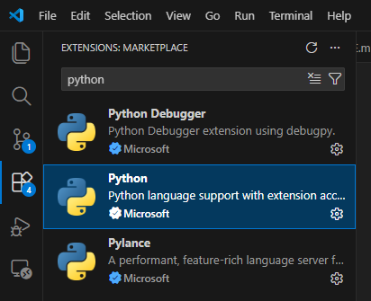
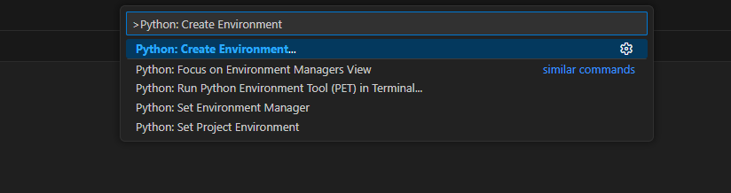
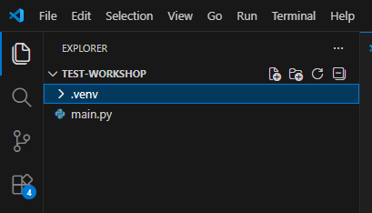
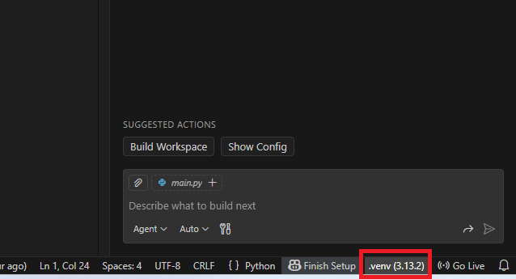
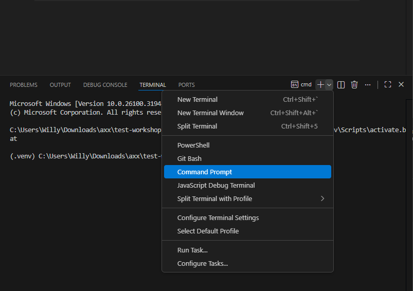

# Membuat Python Virtual Environment di Visual Studio Code 

Dokumen ini menjelaskan cara **membuat dan menggunakan Python virtual environment (venv) di Visual Studio Code** menggunakan **antarmuka grafis (GUI)**, tanpa mengetik perintah manual di terminal.

---

## Prasyarat

Pastikan hal berikut sudah tersedia:

- **Python 3.x** sudah terinstal  
  Saat instalasi, pastikan opsi **Add Python to PATH** dicentang.
- **Visual Studio Code**
- **Ekstensi Python** dari Microsoft di VS Code

---

## Langkah 1: Install Ekstensi Python di VS Code

1. Buka **Visual Studio Code**
2. Klik menu **Extensions** di sidebar kiri
3. Cari **Python**
4. Install **Python (Microsoft)**

   
---

## Langkah 2: Buka Folder Proyek

1. Klik **File → Open Folder…**
2. Pilih folder proyek Anda  
   Contoh:
   ```
   C:\Projects\my-python-project
   ```
3. Klik **Select Folder**

---

## Langkah 3: Buka Command Palette

1. Tekan **Ctrl + Shift + P**
2. Command Palette akan muncul di bagian atas

   
---

## Langkah 4: Membuat Virtual Environment (GUI)

1. Di Command Palette, ketik:
   ```
   Python: Create Environment
   ```
2. Pilih **Python: Create Environment**
3. Pilih **Venv**
4. Pilih versi Python yang akan digunakan
   
5. Tunggu hingga VS Code selesai membuat environment

VS Code akan otomatis membuat folder:

```
.venv/
```

---

## Langkah 5: Verifikasi Folder `.venv`

1. Lihat panel **Explorer**
2. Pastikan folder **.venv** sudah muncul di root proyek
    
---

## Langkah 6: Memilih Interpreter Virtual Environment

1. Perhatikan **status bar** di kanan bawah VS Code
2. Klik informasi versi Python
3. Pilih interpreter yang mengarah ke:
   ```
   .venv\Scripts\python.exe
   ```
   

---

## Langkah 7: Aktivasi Otomatis Virtual Environment

1. Klik **Terminal → Command Prompt**
2. VS Code akan mengaktifkan virtual environment secara otomatis
3. Akan terlihat prefix:
   ```
   (.venv)
   ```
   

> Tidak perlu menjalankan perintah aktivasi manual.

---

## Langkah 8: Menjalankan File Python (GUI)

1. Buka file Python (misalnya `main.py`)
2. Klik tombol **▶ Run** di kanan atas editor
3. Program akan dijalankan menggunakan `.venv`

---

## Langkah 9: Menambahkan `.venv` ke `.gitignore` (Disarankan)

1. Di panel Explorer, klik kanan → **New File**
2. Beri nama file:
   ```
   .gitignore
   ```
3. Tambahkan isi berikut:
   ```
   .venv/
   ```

---

## Struktur Proyek Akhir

```text
my-python-project/
├── .venv/
├── .gitignore
├── main.py
└── README.md
```

---

## Catatan dan Praktik Terbaik

- Gunakan **satu virtual environment per proyek**
- Jangan commit folder `.venv` ke Git
- Biarkan VS Code mengelola aktivasi environment
- Jika versi Python berubah, buat ulang virtual environment

---

## Ringkasan

- Semua langkah dilakukan melalui **GUI VS Code**
- Cocok untuk pemula, mahasiswa, dan tim profesional
- Setup rapi, konsisten, dan mudah direproduksi
- Tidak perlu menghafal perintah terminal

---
