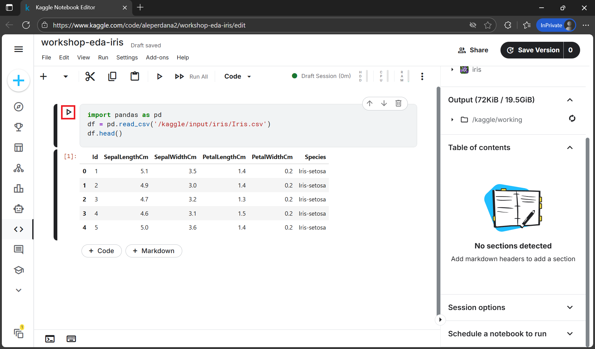
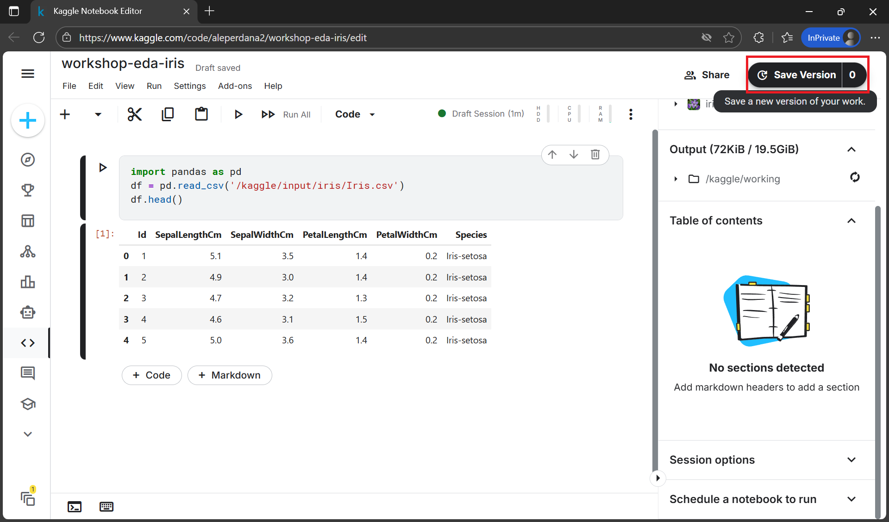
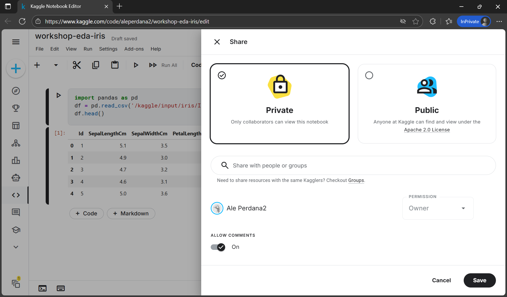

# Pengenalan Kaggle Notebook

## Tujuan Sesi
- Memahami peran Kaggle Notebook dalam ekosistem analisis data
- Mampu membuat, menjalankan, dan menyimpan notebook di Kaggle
- Menyambungkan Kaggle Notebook dengan dataset publik
- Menyiapkan notebook awal yang terintegrasi dengan struktur proyek di GitHub

---

## Apa Itu Kaggle Notebook?

Kaggle Notebook adalah **lingkungan komputasi cloud gratis** berbasis Jupyter yang memungkinkan:
- Menjalankan kode Python/R langsung di browser
- Mengakses dataset publik Kaggle tanpa perlu download
- Berkolaborasi via komentar dan versi
- Menyimpan hasil eksplorasi tanpa konfigurasi lokal

> 💡 Tidak perlu instal Python, Jupyter, atau library — semua sudah tersedia!

---

## Keunggulan Kaggle Notebook untuk Kolaborasi Data
- **Gratis & cloud-based**: Akses dari mana saja
- **GPU/TPU tersedia**: Untuk eksperimen ML ringan
- **Versioning otomatis**: Setiap perubahan tersimpan sebagai versi
- **Integrasi dataset**: Langsung gunakan dataset publik (termasuk kompetisi)
- **Publikasi mudah**: Bisa dibagikan sebagai link atau diposting ke komunitas

---

## Langkah 1: Daftar Akun Kaggle

1. Buka [https://kaggle.com](https://kaggle.com)
2. Klik **Register**


3. Daftar menggunakan akun Google (disarankan) atau email
4. Verifikasi email jika diminta
5. Selesai! Anda siap membuat notebook

> ⚠️ Pastikan akun Kaggle menggunakan **email yang sama** dengan GitHub untuk memudahkan integrasi di masa depan.

---

## Langkah 2: Membuat Kaggle Notebook Pertama

1. Kunjungi [Datasets](https://www.kaggle.com/datasets)


2. Cari dataset sederhana, misal: `Iris Species` (ideal untuk pemula)


3. Klik dataset untuk membukanya


4. Klik tombol **New Notebook** untuk membuat notebook baru


5. Kaggle otomatis membuka editor notebook dengan dataset tersebut terpasang


6. Ganti judul notebook (klik di bagian atas) → contoh: `workshop-eda-iris`


7. Kode contoh otomatis muncul, misal:
```python
import pandas as pd
df = pd.read_csv('/kaggle/input/iris/Iris.csv')
df.head()
```


8. Klik tombol **▶️ Run** untuk menjalankan kode. Hasilnya akan muncul di bawah sel


---

## Struktur File di Kaggle Notebook

Di dalam notebook, Anda bisa mengakses:
- Dataset: di `/kaggle/input/<nama-dataset>/`
- Output: di `/kaggle/working/` (file yang Anda hasilkan)
- Library: sudah terinstal (pandas, numpy, matplotlib, seaborn, scikit-learn, dll)

> 💡 Tidak perlu `pip install` untuk library populer!

---

## Praktik: Simpan dan Publikasikan Notebook

1. Klik tombol **Save Version** untuk menyimpan notebook


2. Pilih **Quick Save** untuk menyimpan notebook (tanpa menjalankan semua kode)
   - Atau gunakan **Save & Run All** jika ingin menyimpan sekaligus menjalankan semua kode


3. Klik tombol **Share** untuk mengatur privasi notebook
   - Pilih **private** atau **public**
   - Klik **Save** untuk menyimpan pengaturan


4. Copy link notebook → akan digunakan untuk integrasi dengan GitHub di Hari 2


---

## Tips & Best Practices
- Gunakan markdown cell untuk menjelaskan setiap langkah
- Jangan simpan data sensitif — notebook publik bisa dilihat siapa saja
- Manfaatkan fitur **Add Data** untuk menggabungkan lebih dari satu dataset
- Untuk proyek tim, pertimbangkan **Kaggle Datasets privat**