# Manajemen Notebook dan Integrasi GitHub di Kaggle

## Tujuan Sesi
- Memahami cara memulai proyek di Kaggle melalui import notebook
- Mampu mengimpor notebook ke Kaggle melalui file `.ipynb` atau melalui integrasi GitHub
- Memahami prasyarat koneksi akun GitHub ke Kaggle untuk mengakses repositori (termasuk repositori privat)

---

## 1. Memulai Project di Kaggle

Sebelum mulai menulis kode, terdapat beberapa cara untuk memulai pekerjaan di environment Kaggle.

### A. Opsi 1: Membuat Notebook Baru di Kaggle

Gunakan opsi ini jika Anda ingin memulai dari notebook kosong langsung di Kaggle.

**Langkah-langkah:**

1. Buka Kaggle dan login.
2. Klik tombol **+ Create** di sidebar kiri, lalu pilih **Notebook**.

   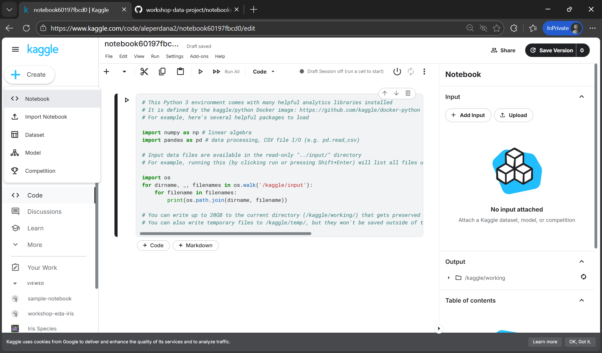

3. Notebook baru akan dibuat dan Anda akan diarahkan ke editor notebook.

---

### B. Opsi 2: Import File `.ipynb`

Format `.ipynb` (IPython Notebook) adalah format standar Jupyter Notebook yang berisi kode, teks penjelasan, dan output visualisasi.

**Langkah-langkah:**

1. Buka Kaggle dan login.
2. Klik tombol **+ Create** di sidebar kiri, lalu pilih **New Notebook**.

    

3. klik menu **File**.
4. Klik **Browse Files** dan pilih file `.ipynb` dari komputer lokal Anda.
   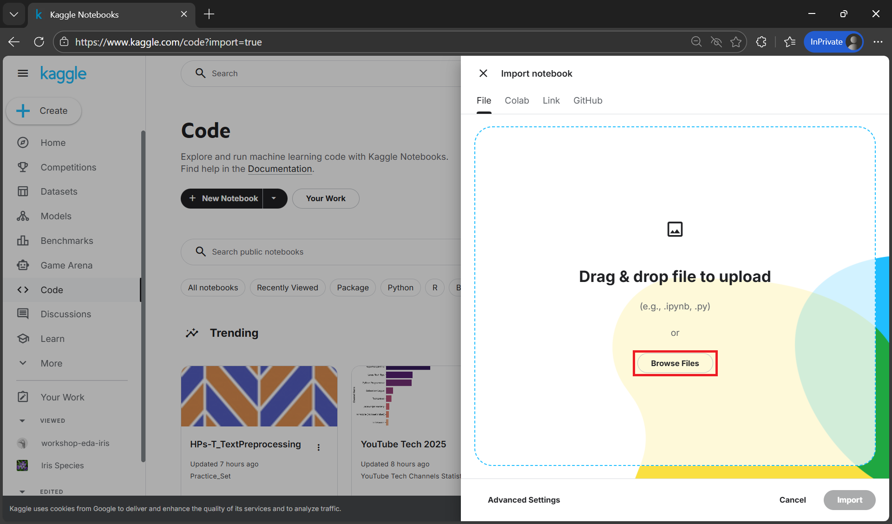
   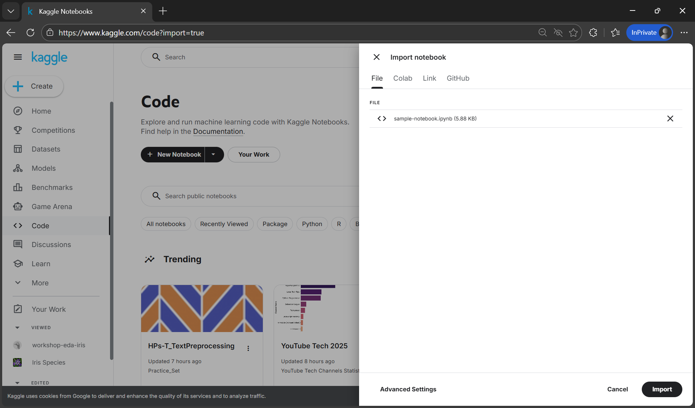
4. Klik **Import** untuk mengimpor notebook ke kaggle.
   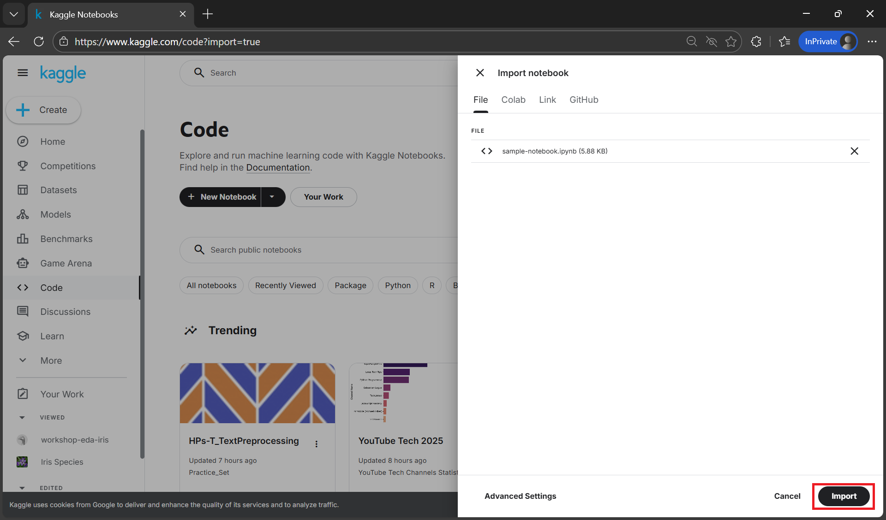

Setelah proses selesai, notebook akan dimuat secara otomatis di editor Kaggle.

---

### C. Opsi 3: Import dari GitHub

Opsi ini menghubungkan repositori GitHub Anda langsung ke Kaggle sehingga Anda dapat mengambil file notebook dari repository.

**Langkah-langkah:**

1. Klik tombol **+ Create**, lalu pilih **Import Notebook**.
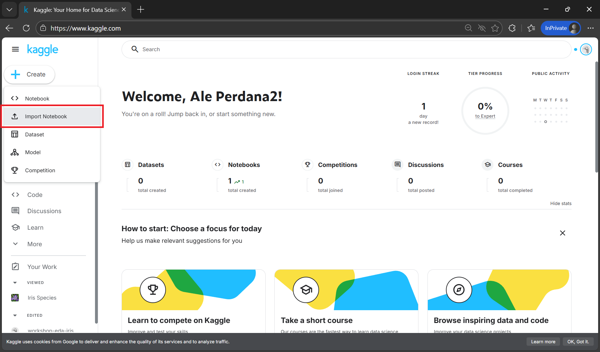
2. Pada jendela **Import notebook**, pilih tab **GitHub**.
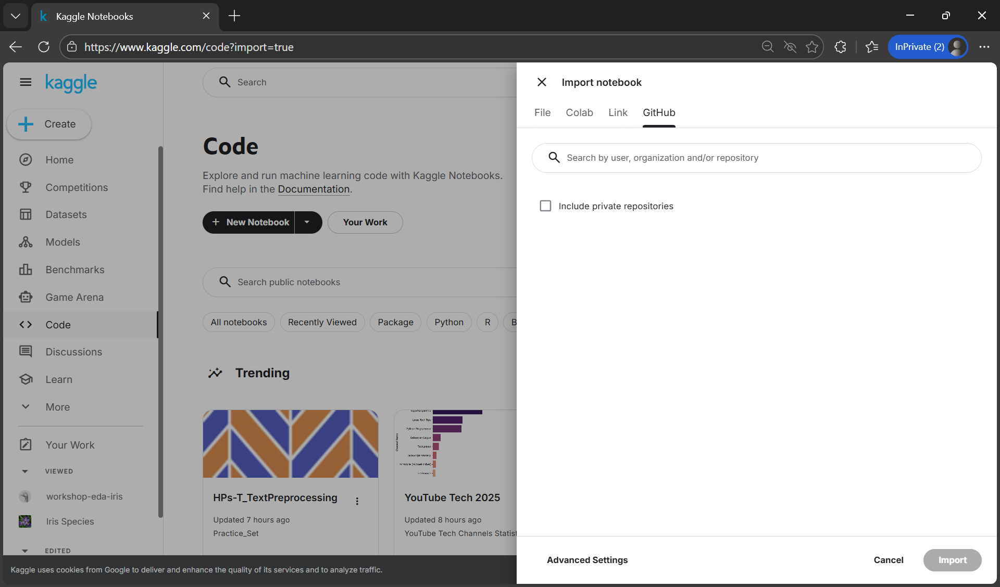
3. Jika repositori Anda bersifat privat, centang **Include private repositories**.
4. Jika ini pertama kali Anda menghubungkan GitHub, akan muncul jendela otorisasi.
   Klik **Authorize Kaggle** untuk menautkan akun GitHub Anda.
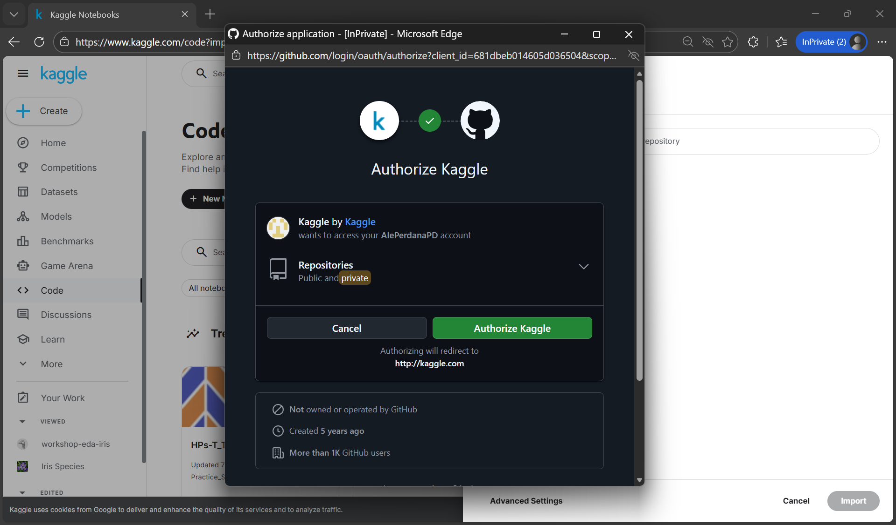
5. Setelah otorisasi berhasil, kembali ke jendela import. Pastikan opsi privat (jika digunakan) sudah aktif.
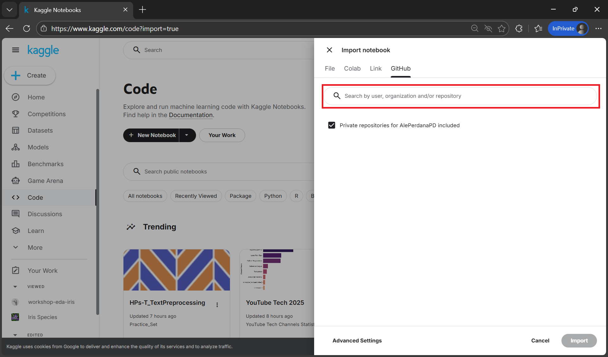
6. Pada kotak pencarian, ketik nama repositori dengan format: `<nama-github>/<nama-repository>`.
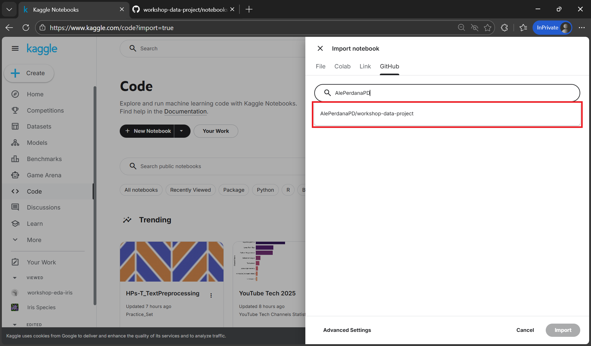
7. Repositori akan muncul di bawah kotak pencarian. Klik repositori tersebut.
8. (Opsional) Pilih branch yang ingin digunakan (misalnya `main`).
9.  Pada bagian **File**, pilih notebook `.ipynb` yang ingin diimpor dari repositori.
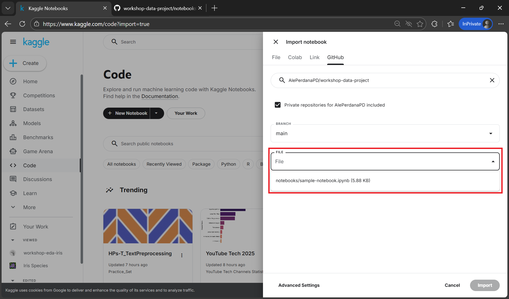
10.  Klik **Import** untuk mengimpor notebook dari GitHub ke Kaggle.
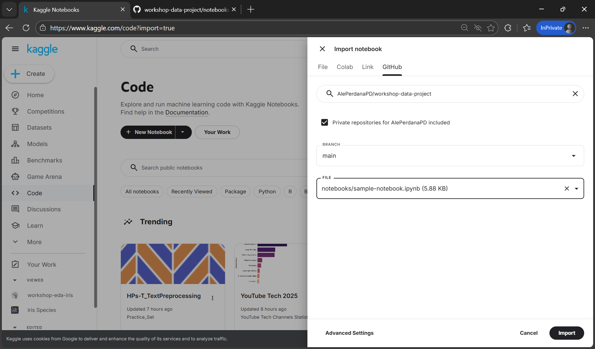

Setelah proses selesai, notebook akan dimuat secara otomatis di editor Kaggle.

---