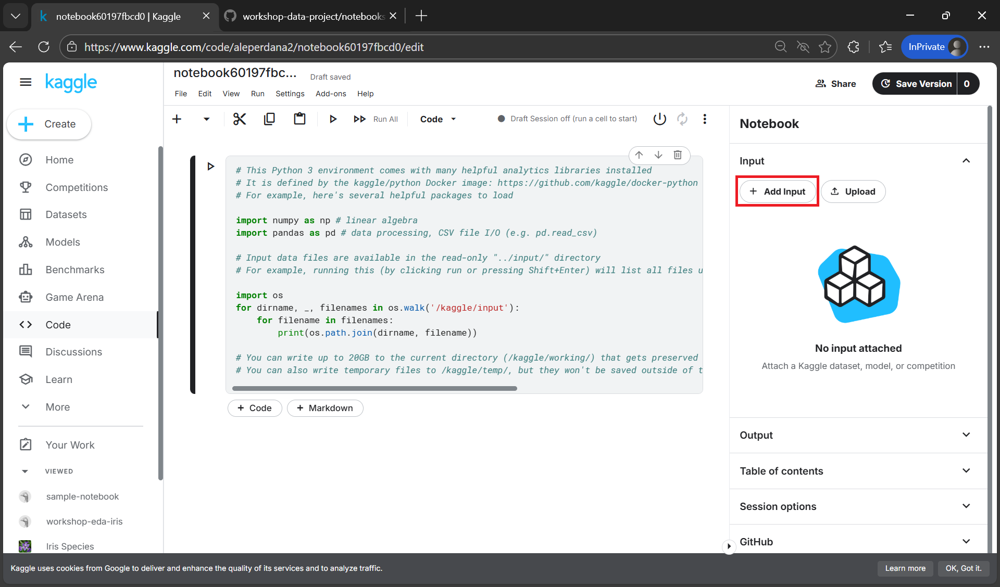
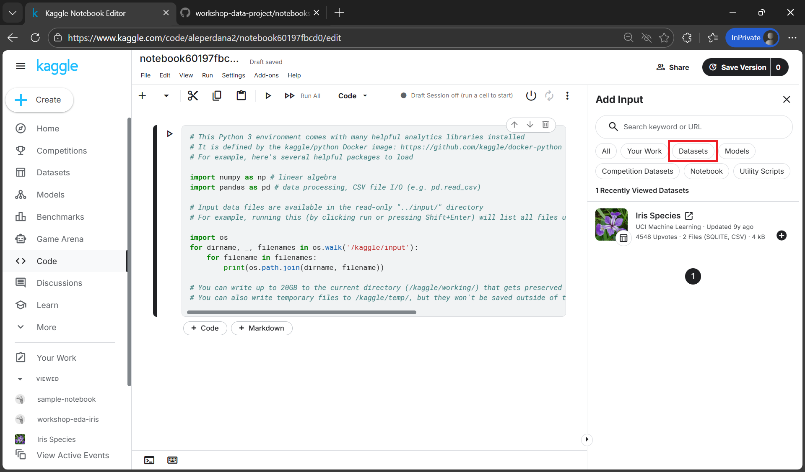
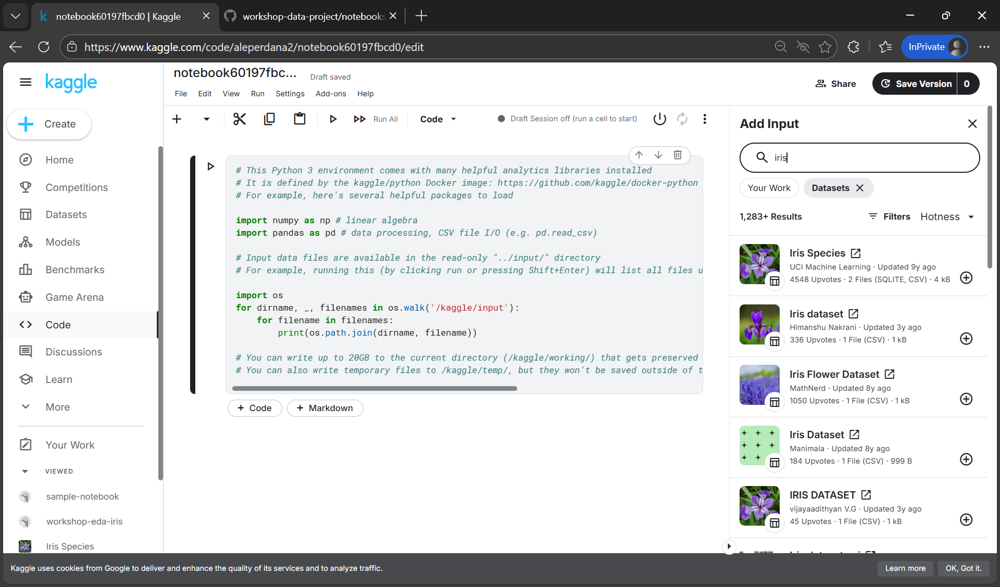
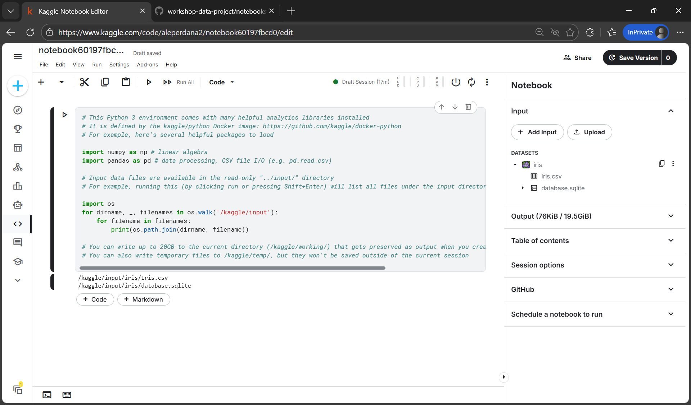
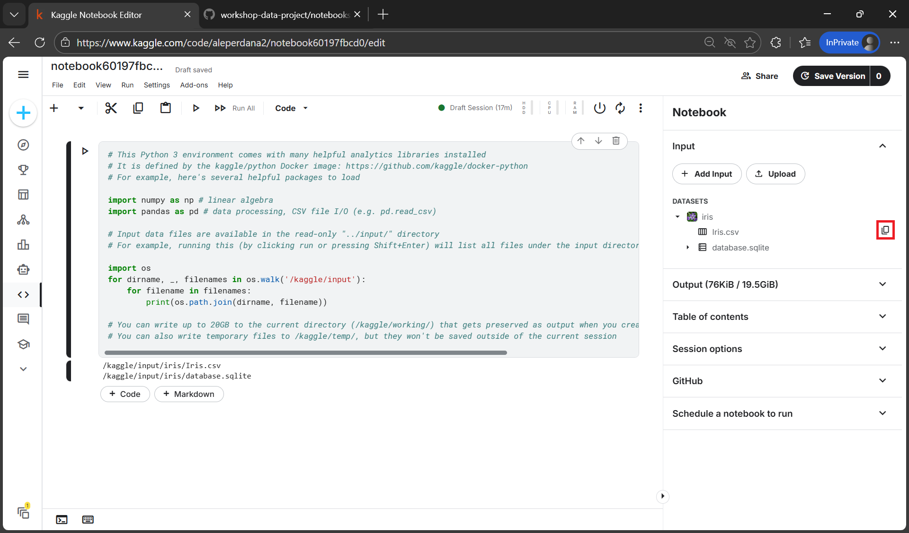
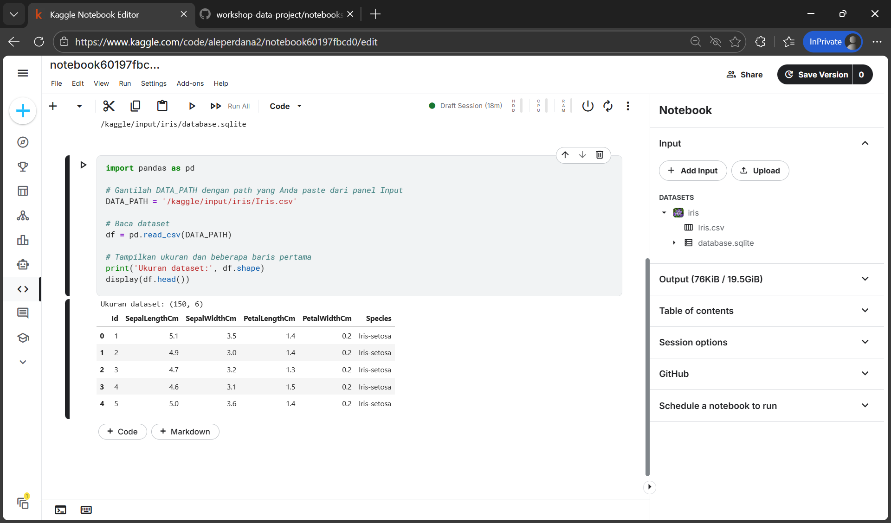
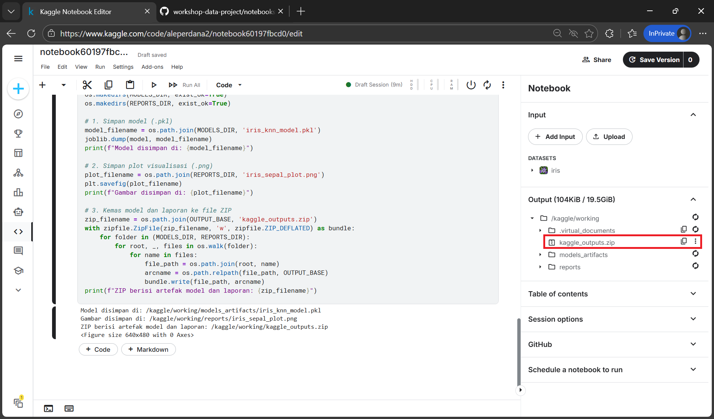
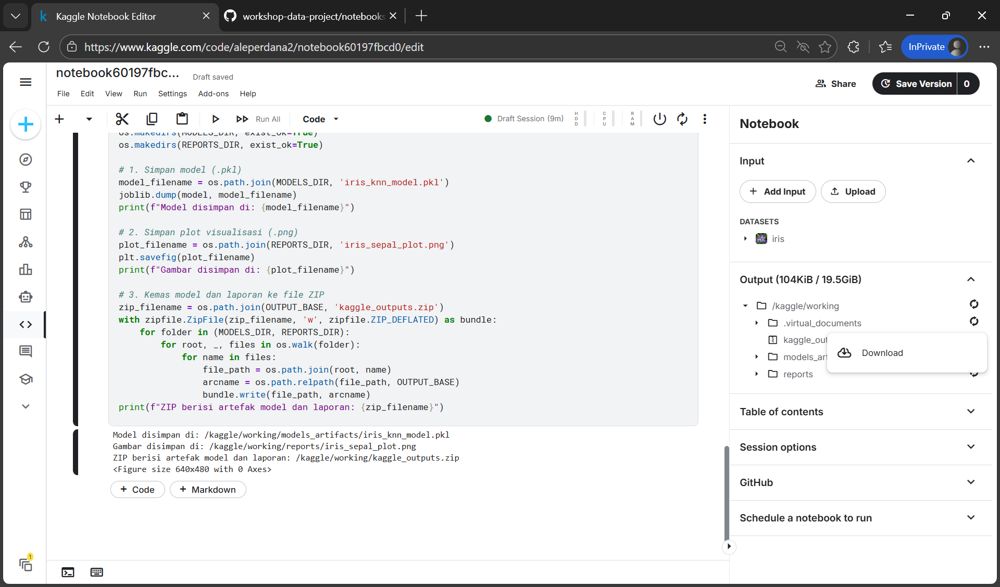

# Manajemen Data di Kaggle: Input, Output, dan Artefak

## Tujuan Sesi
- Memahami perbedaan direktori input (`/kaggle/input`) dan direktori kerja/output (`/kaggle/working`) di Kaggle
- Mampu menambahkan dataset ke notebook melalui fitur **Add Input**
- Mampu menemukan path dataset yang benar di environment Kaggle
- Mampu menyimpan artefak (model dan gambar) ke direktori `/kaggle/working`
- Mampu mengunduh artefak dari panel **Output**

---

## 1. Konsep Direktori Data di Kaggle

Di Kaggle, struktur direktori berbeda dengan komputer lokal. Memahami struktur ini penting agar kode tidak mengalami error saat membaca data atau menyimpan artefak.

### Alur Data (Pipeline)

- **Input (`/kaggle/input`)**: lokasi dataset berada. Bersifat **read-only** (hanya bisa dibaca, tidak bisa ditulis).
- **Proses**: eksekusi kode berjalan di notebook (menggunakan RAM/GPU sesuai konfigurasi).
- **Working/Output (`/kaggle/working`)**: lokasi menyimpan hasil (model, gambar, CSV). Bersifat **writeable** (dapat ditulis).

---

## 2. Menambahkan Dataset sebagai Input

Sebelum membaca data, pastikan dataset sudah ditambahkan ke notebook.

**Cara menambahkan dataset:**

1. Di editor notebook, lihat panel kanan (sidebar).
2. Pada bagian **Input**, klik **+ Add Input**.


3. Pada jendela Add Input, pilih tab **Datasets** untuk menampilkan daftar dataset.


4. Pada kotak pencarian, ketik `Iris Species` lalu tekan Enter.


5. Ketika hasil muncul, klik tombol **+** di samping dataset untuk menambahkannya ke notebook Anda.


6. Setelah ditambahkan, tutup jendela Add Input dengan menekan tombol **X** di pojok kanan atas.


7. Dataset Iris kini tersedia di panel **Input** dan juga di filesystem virtual Kaggle (di bawah `/kaggle/input`).

8. Klik dataset **Iris Species** untuk membuka daftar file yang tersedia.


9.  Di sebelah file `Iris.csv`, tekan tombol **Copy path** (ikon salin) untuk menyalin jalur file.


10. Kembali ke notebook, buka atau buat sebuah cell kode, lalu tempel (paste) jalur yang telah disalin. Contoh code sederhana untuk membaca dan menampilkan sebagian isi dataset:

```python
import pandas as pd

# Gantilah DATA_PATH dengan path yang Anda paste dari panel Input
DATA_PATH = '<dataset-path>'

# Baca dataset
df = pd.read_csv(DATA_PATH)

# Tampilkan ukuran dan beberapa baris pertama
print('Ukuran dataset:', df.shape)
display(df.head())
```



Dataset sekarang dapat diakses dari notebook menggunakan path yang Anda paste.

---

## 3. Implementasi Alur: Membaca Input dan Menyimpan Artefak dengan dataset Iris

Berikut contoh implementasi dalam bentuk cell notebook. Anda dapat menyalin bagian-bagian ini ke dalam file `.ipynb`.

---

### Cell 1: Setup & Membaca Input

**Tujuan:** Menemukan path dataset yang benar dan membaca dataset Iris dari direktori input Kaggle.

```python
import os
import pandas as pd

print("File tersedia di input:")
for dirname, _, filenames in os.walk('/kaggle/input'):
    for filename in filenames:
        print(os.path.join(dirname, filename))

# 2. Definisikan path dataset (sesuaikan dengan hasil print di atas)
# Contoh untuk dataset Iris yang umum di Kaggle
DATA_PATH = '/kaggle/input/iris/Iris.csv'

# 3. Baca dataset sebagai input
try:
    df = pd.read_csv(DATA_PATH)
    print("\nDataset berhasil dibaca!")
    print(f"Ukuran Data: {df.shape}")
    display(df.head())
except FileNotFoundError:
    print("Error: File tidak ditemukan. Pastikan Anda sudah melakukan 'Add Input' dataset Iris.")
```

---

### Cell 2: Pemrosesan Data (Training Model Sederhana)

**Tujuan:** Membuat artefak (hasil kerja) berupa model dan visualisasi.

**Metode:** Data dipecah menjadi set latihan dan uji dengan `train_test_split` untuk menjaga generalisasi. Model `KNeighborsClassifier` dengan nilai `k=3` digunakan karena sederhananya dan cocok untuk dataset kecil seperti Iris. Evaluasi akurasi memakai `accuracy_score`, lalu visualisasi sepal plot dibuat guna memahami persebaran kelas.

```python
from sklearn.model_selection import train_test_split
from sklearn.neighbors import KNeighborsClassifier
from sklearn.metrics import accuracy_score
import matplotlib.pyplot as plt
import seaborn as sns

# Preprocessing sederhana
X = df.drop(['Id', 'Species'], axis=1)  # fitur
y = df['Species']                       # target

# Split data
X_train, X_test, y_train, y_test = train_test_split(
    X, y, test_size=0.2, random_state=42
)

# Training model
model = KNeighborsClassifier(n_neighbors=3)
model.fit(X_train, y_train)

# Evaluasi
acc = accuracy_score(y_test, model.predict(X_test))
print(f"Akurasi Model: {acc:.2f}")

# Membuat visualisasi (untuk disimpan pada langkah berikutnya)
plt.figure(figsize=(6, 4))
sns.scatterplot(x=df['SepalLengthCm'], y=df['SepalWidthCm'], hue=df['Species'])
plt.title("Iris Sepal Distribution")
```

---

### Cell 3: Menyimpan Output (Model & Gambar)

**Tujuan:** Menyimpan hasil model dan gambar ke direktori terpisah, lalu mengemasnya menjadi satu file ZIP agar mudah diunduh.

```python
import os
import joblib
import zipfile

# Struktur direktori keluaran
OUTPUT_BASE = '/kaggle/working'
MODELS_DIR = os.path.join(OUTPUT_BASE, 'models_artifacts')
REPORTS_DIR = os.path.join(OUTPUT_BASE, 'reports')

os.makedirs(MODELS_DIR, exist_ok=True)
os.makedirs(REPORTS_DIR, exist_ok=True)

# 1. Simpan model (.pkl)
model_filename = os.path.join(MODELS_DIR, 'iris_knn_model.pkl')
joblib.dump(model, model_filename)
print(f"Model disimpan di: {model_filename}")

# 2. Simpan plot visualisasi (.png)
plot_filename = os.path.join(REPORTS_DIR, 'iris_sepal_plot.png')
plt.savefig(plot_filename)
print(f"Gambar disimpan di: {plot_filename}")

# 3. Kemas model dan laporan ke file ZIP
zip_filename = os.path.join(OUTPUT_BASE, 'kaggle_outputs.zip')
with zipfile.ZipFile(zip_filename, 'w', zipfile.ZIP_DEFLATED) as bundle:
    for folder in (MODELS_DIR, REPORTS_DIR):
        for root, _, files in os.walk(folder):
            for name in files:
                file_path = os.path.join(root, name)
                arcname = os.path.relpath(file_path, OUTPUT_BASE)
                bundle.write(file_path, arcname)
print(f"ZIP berisi artefak model dan laporan: {zip_filename}")
```

---

## 4. Mengunduh Artefak dari Panel Output

Untuk mengunduh artefak, fokus pada file ZIP yang sudah berisi seluruh output agar lebih ringkas:

1. Lihat panel kanan (sidebar).
2. Buka bagian **Output**.
3. Buka folder '/kaggle/working' dan cari file `kaggle_outputs.zip`.
4. Klik titik tiga di sebelah nama file ZIP, lalu pilih **Download**.


5. Setelah diunduh, Anda dapat mengekstrak ZIP tersebut untuk mendapatkan folder `models_artifacts` (isi `.pkl`) dan `reports` (gambar `.png`).

Memasukkan model dan plot ke dalam ZIP memudahkan distribusi karena semua artefak tersimpan rapi dalam satu file yang dapat langsung Anda bagikan atau simpan.


