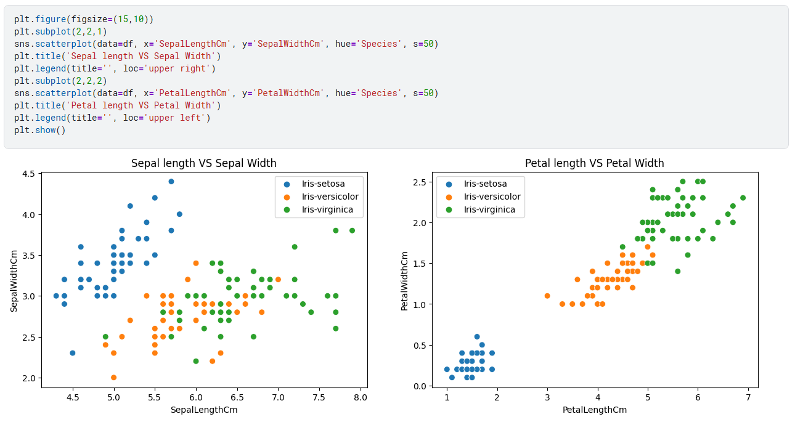
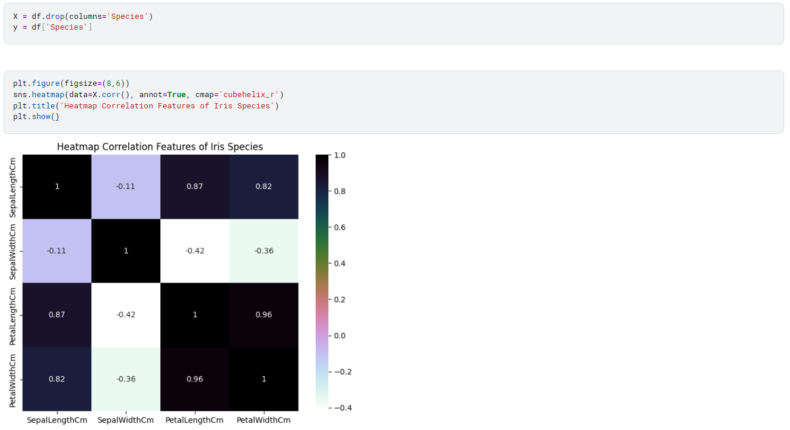

# Eksplorasi Data (EDA) dengan Dataset Iris

## Tujuan Sesi
Setelah mengikuti sesi ini, peserta diharapkan mampu untuk:

- Memahami konsep **Exploratory Data Analysis (EDA)** dan perannya dalam alur data science  
- Melakukan **loading, inspeksi, dan validasi data** menggunakan *pandas*  
- Mengidentifikasi kualitas data serta memastikan tidak adanya *missing values*  
- Membuat dan membaca **visualisasi distribusi data dan hubungan antar fitur**  
- Menginterpretasikan insight awal sebagai dasar **pengambilan keputusan analisis dan pemodelan**

---

## Apa Itu Exploratory Data Analysis (EDA)?

> **EDA (Exploratory Data Analysis)** adalah proses awal untuk memahami data sebelum melakukan analisis lanjutan atau membangun model.

Secara sederhana, EDA dapat dianalogikan seperti **berkenalan dengan seseorang baru**.

Saat pertama bertemu seseorang, kita biasanya:
- menanyakan informasi dasar,
- mengamati kebiasaan atau karakter,
- mencoba memahami pola perilakunya.

**EDA melakukan hal yang sama terhadap data**, dengan pertanyaan seperti:
- Apa saja isi dataset ini?
- Apakah datanya lengkap dan rapi?
- Apakah ada pola menarik atau keanehan?
- Fitur mana yang tampak penting?

> 🔍 **Tujuan utama EDA**:
> - Memastikan kualitas dan kelayakan data  
> - Menemukan pola dan insight awal  
> - Menentukan pendekatan analisis dan pemodelan selanjutnya

---

## Kenalan dengan Dataset Iris

> **Dataset Iris** berisi data pengukuran bunga Iris dari tiga spesies berbeda:
> - *Iris setosa*
> - *Iris versicolor*
> - *Iris virginica*

Untuk setiap bunga, tersedia **empat fitur numerik** (dalam satuan cm):

- Panjang sepal (`SepalLengthCm`)
- Lebar sepal (`SepalWidthCm`)
- Panjang petal (`PetalLengthCm`)
- Lebar petal (`PetalWidthCm`)

Dataset ini terdiri dari:
- **150 sampel**
- **50 sampel per spesies** (seimbang)

Dataset Iris sering digunakan sebagai *benchmark* karena strukturnya bersih dan mudah dipahami, sehingga ideal untuk mempelajari EDA dan klasifikasi.

---

## Langkah-Langkah EDA (Praktik di Kaggle Notebook)

### Langkah 1: Memuat Data dan Melihat Sekilas Isinya

```python
import pandas as pd

df = pd.read_csv('/kaggle/input/iris/Iris.csv')
df.head()
```


**Penjelasan:**
- `pd.read_csv(...)` memuat file CSV menjadi **DataFrame**
- `df.head()` menampilkan 5 baris pertama untuk mengenali struktur data

---

### Langkah 2: Memeriksa Kualitas dan Struktur Data

```python
df.info()
df.isnull().sum()
```


**Penjelasan:**
- `df.info()` menunjukkan jumlah data, tipe kolom, dan kelengkapan
- `df.isnull().sum()` memastikan tidak ada nilai kosong

> ✅ Dataset Iris bersih dan siap dianalisis

---

### Langkah 3: Statistik Deskriptif

```python
df.describe().T
```


**Penjelasan:**
- Menampilkan statistik dasar seperti mean, standar deviasi, min, dan max
- `.T` digunakan agar tabel lebih mudah dibaca

---

### Langkah 4: Menghapus Kolom yang Tidak Relevan

```python
df = df.drop(columns='Id')
```


**Penjelasan:**
- Kolom `Id` hanyalah nomor urut dan tidak memberi nilai analitis

---

### Langkah 5: Melihat Distribusi Tiap Fitur

```python
import seaborn as sns
import matplotlib.pyplot as plt

plt.figure(figsize=(15,10))
sns.histplot(data=df, x='SepalLengthCm', kde=True)
plt.show()
```


**Insight:**
- Fitur petal menunjukkan distribusi bimodal
- Menandakan adanya pemisahan spesies

---

### Langkah 6: Membandingkan Fitur Antar Spesies

```python
sns.scatterplot(
    data=df,
    x='PetalLengthCm',
    y='PetalWidthCm',
    hue='Species'
)
```



**Insight utama:**
- *Iris setosa* terpisah sempurna
- Petal adalah fitur paling diskriminatif

---

### Langkah 7: Analisis Korelasi Antar Fitur

```python
X = df.drop(columns='Species')
sns.heatmap(X.corr(), annot=True)
```



**Temuan:**
- Korelasi `PetalLength` dan `PetalWidth` sangat tinggi (**0.96**)
- Menjelaskan efektivitas fitur petal dalam klasifikasi

---

## Penutup

EDA membantu kita memahami data secara menyeluruh sebelum membangun model. Dengan memahami distribusi, hubungan antar fitur, dan kualitas data, keputusan analisis dan pemodelan dapat dilakukan dengan lebih tepat dan terarah.

