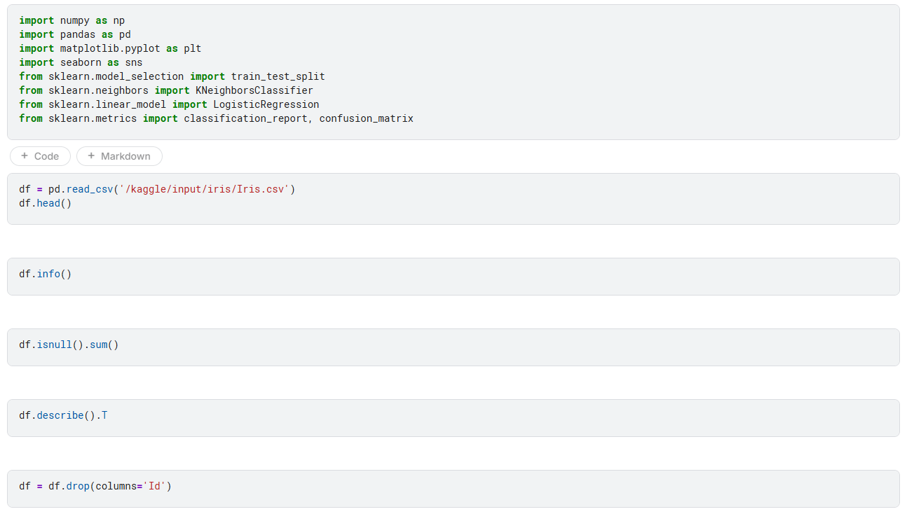
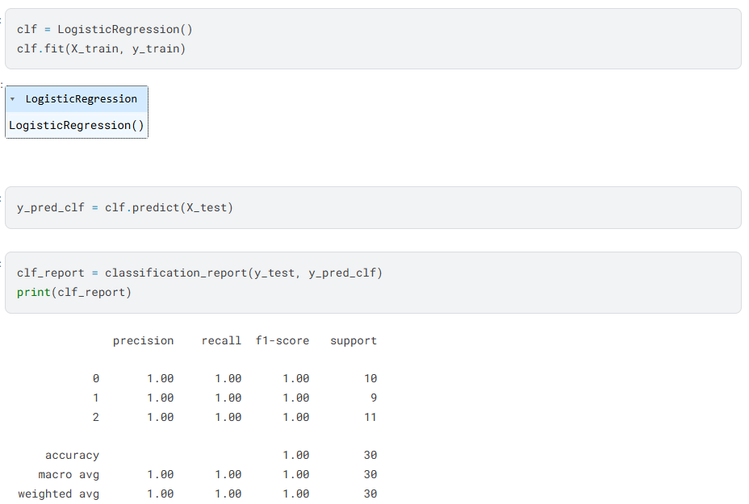

# Storytelling Data
## Menyampaikan Insight Bernilai dari Analisis Data

## Tujuan Sesi
Dokumen ini dirancang sebagai **panduan praktis dan contoh nyata** bagaimana hasil analisis data dapat dikomunikasikan secara efektif melalui storytelling.

Setelah mempelajari materi ini, pembaca diharapkan mampu:

- Memahami **mengapa storytelling krusial** dalam proyek data science  
- Menyusun alur cerita yang runtut dari proses eksplorasi data  
- Mengubah hasil **Exploratory Data Analysis (EDA)** menjadi narasi yang bermakna  
- Menyajikan insight teknis agar **mudah dipahami oleh pemangku kepentingan non-teknis**

---

## Mengapa Storytelling Penting dalam Proyek Data Science?

> **Data tanpa cerita hanyalah angka.**  
> **Cerita yang baik mengubah angka menjadi keputusan.**

Dalam praktik nyata, hasil analisis sering kali gagal memberikan dampak bukan karena salah, melainkan karena **tidak dikomunikasikan dengan tepat**.

Sebagai contoh:

> “Petal length dan petal width sangat membedakan spesies Iris.”

Jika pernyataan ini hanya disertai grafik dan tabel, pembaca non-teknis mungkin tidak memahami relevansinya. Namun, ketika disampaikan sebagai berikut:

> “Spesies bunga Iris dapat diidentifikasi hanya dari ukuran kelopaknya, tanpa melihat bentuk bunga secara keseluruhan. Ini membuka peluang pengembangan sistem klasifikasi otomatis berbasis kamera.”

Maka data tersebut berubah menjadi **nilai bisnis dan teknis yang konkret**.

🎯 **Tujuan utama storytelling data** adalah:
> Mengubah hasil analisis menjadi **pemahaman**, lalu menjadi **keputusan**.

Storytelling memastikan bahwa insight tidak berhenti sebagai temuan teknis, tetapi dapat digunakan sebagai dasar diskusi, perencanaan, dan aksi nyata.

---

## Struktur Dasar Cerita Data yang Efektif

Setiap cerita data yang efektif selalu memiliki tiga komponen utama:

### 1. Masalah atau Konteks
Menjawab pertanyaan: **Apa yang ingin kita pahami?**

Contoh:
> *“Bagaimana membedakan tiga spesies bunga Iris berdasarkan ukuran morfologisnya?”*

---

### 2. Eksplorasi dan Temuan
Menjawab pertanyaan: **Apa yang ditemukan dari data?**

- Fitur petal jauh lebih informatif dibanding sepal  
- *Iris setosa* terpisah jelas dari dua spesies lainnya

---

### 3. Kesimpulan dan Makna
Menjawab pertanyaan: **Apa arti temuan ini?**

> *“Iris setosa dapat diidentifikasi dengan sangat mudah, sementara versicolor dan virginica memerlukan analisis yang lebih detail.”*

---

## Studi Kasus: Membangun Cerita dari EDA Dataset Iris

### 1. Konteks Dataset: Iris Species

Dataset Iris merupakan dataset klasik yang diperkenalkan oleh **Ronald Fisher (1936)** dan hingga kini masih digunakan sebagai referensi dasar dalam pembelajaran machine learning.

Karakteristik dataset:
- Total **150 sampel**
- Terdiri dari **3 spesies** dengan distribusi seimbang
- Memiliki **4 fitur numerik utama** (sepal & petal)

Fokus utama proyek ini adalah **Exploratory Data Analysis (EDA)**, yaitu memahami struktur data, pola distribusi, dan hubungan antar fitur **sebelum** membangun model machine learning.

---

### 2. Pembersihan dan Validasi Data

**Insight utama:**
- Fitur petal menunjukkan pola yang jauh lebih informatif dibanding sepal
- Distribusi dan pemisahan kelas terlihat konsisten di berbagai visualisasi

> **Makna penting:**  
Insight yang muncul berulang di berbagai grafik menunjukkan bahwa temuan ini **stabil dan dapat dipercaya**.

---

### 3. Exploratory Data Analysis (EDA)

Pada tahap ini, analisis difokuskan untuk menjawab pertanyaan utama:
- Fitur apa yang paling membedakan spesies?
- Seberapa jelas pemisahan antar kelas?
- Apakah data mendukung pemodelan sederhana atau kompleks?

EDA membantu:
- Mengidentifikasi pola
- Membandingkan distribusi antar spesies
- Menentukan fitur paling informatif

---

### Grafik 1: Distribusi Fitur (Histogram)

**Insight utama:**
- Fitur petal menunjukkan pola yang jauh lebih informatif dibanding sepal
- Distribusi dan pemisahan kelas terlihat konsisten di berbagai visualisasi

> **Makna penting:**  
Insight yang muncul berulang di berbagai grafik menunjukkan bahwa temuan ini **stabil dan dapat dipercaya**.

---

### Grafik 2: Scatter Plot Antar Fitur

**Insight utama:**
- Fitur petal menunjukkan pola yang jauh lebih informatif dibanding sepal
- Distribusi dan pemisahan kelas terlihat konsisten di berbagai visualisasi

> **Makna penting:**  
Insight yang muncul berulang di berbagai grafik menunjukkan bahwa temuan ini **stabil dan dapat dipercaya**.

---

### Grafik 3: Heatmap Korelasi

**Insight utama:**
- Fitur petal menunjukkan pola yang jauh lebih informatif dibanding sepal
- Distribusi dan pemisahan kelas terlihat konsisten di berbagai visualisasi

> **Makna penting:**  
Insight yang muncul berulang di berbagai grafik menunjukkan bahwa temuan ini **stabil dan dapat dipercaya**.

---

### Grafik 4: Violin Plot per Spesies

**Insight utama:**
- Fitur petal menunjukkan pola yang jauh lebih informatif dibanding sepal
- Distribusi dan pemisahan kelas terlihat konsisten di berbagai visualisasi

> **Makna penting:**  
Insight yang muncul berulang di berbagai grafik menunjukkan bahwa temuan ini **stabil dan dapat dipercaya**.

---

## Pemodelan dan Evaluasi

### K-Nearest Neighbors (KNN)

Model KNN dengan `k=3` menghasilkan:
- **Akurasi 100%**
- Tidak ada kesalahan klasifikasi

---

### Logistic Regression

Model Logistic Regression juga mencapai:
- **Akurasi 100%**
- Dataset bersifat **linear separable**

---

## Kesimpulan Akhir

- Dataset Iris memiliki struktur yang sangat terpisah
- Fitur petal merupakan kunci utama klasifikasi
- Model sederhana pun dapat bekerja optimal
- EDA menjelaskan *mengapa* model berhasil

---

## Prinsip Penting dalam Storytelling Data

> **Grafik menjawab apa yang terjadi.**  
> **Cerita data menjawab mengapa itu penting.**

Fokuslah pada **makna**, bukan sekadar **metode**.

