# Publikasi & Integrasi GitHub–Kaggle

## Tujuan Sesi
- Memahami alur **publikasi notebook** di Kaggle  
- Menyambungkan hasil analisis di Kaggle dengan **dokumentasi di GitHub**  
- Memahami opsi ekspor notebook dan sinkronisasi perubahan ke GitHub
- Menghasilkan **proyek data terdokumentasi dan dapat diakses publik**  
- Menyiapkan template kolaboratif yang siap digunakan kembali

---

## Mengapa Integrasi GitHub–Kaggle Penting?

> **Kaggle** = tempat menganalisis dan bereksperimen  
> **GitHub** = tempat menyimpan, mendokumentasi, dan berkolaborasi  

Tanpa integrasi:
- Analisis hanya ada di Kaggle → sulit dilacak oleh tim di GitHub  
- Dokumentasi di GitHub tidak mencerminkan hasil nyata

Dengan integrasi:
- Siapa pun bisa **membaca insight** di GitHub  
- Sekaligus **melihat kode & visualisasi** langsung di Kaggle  
- Proyek jadi **reproducible, transparan, dan profesional**

> 🎯 Prinsip kolaborasi modern:  
> **“Satu proyek, dua platform — masing-masing memainkan perannya.”**

---

## Langkah 1: Publikasikan Notebook di Kaggle

### A. Simpan Versi Terakhir
1. Pastikan semua cell sudah dijalankan (lihat tanda ▶️ biru)
2. Klik **Save Version** → pilih **Save & Run All (Commit)**

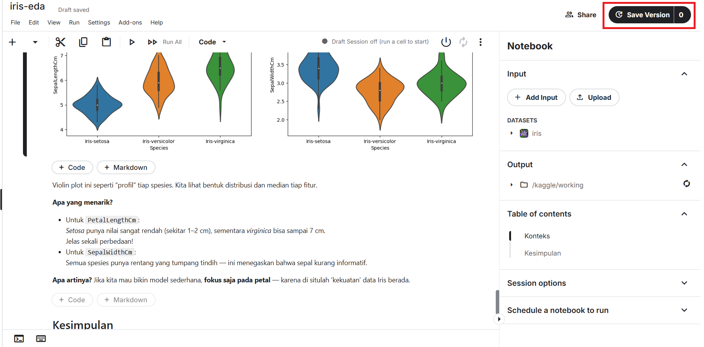


3. Tunggu proses selesai (±2–5 menit)


### B. Ubah ke Status Publik
1. Setelah selesai, Buka notebook Anda di Kaggle
2. Klik tombol **Share** di kanan atas


3. Pilih **"Public"**
4. Salin **URL notebook publik** (misal: `https://www.kaggle.com/username/nama-notebook`)
5. Kemudian save

> ✅ Pastikan:
> - Judul jelas (misal: `EDA Iris – Workshop Kolaborasi Data`)
> - Deskripsi singkat di bagian atas notebook
> - Semua visualisasi muncul dengan baik

---

## Langkah 2: Ekspor & Sinkronisasi Notebook

Setelah notebook sudah final (sudah **Save Version** dan siap dipublikasikan), lakukan salah satu atau kedua opsi berikut untuk mengamankan hasil kerja.

### A. Opsi 1: Download Manual (File `.ipynb`)

Gunakan opsi ini jika Anda ingin menyimpan cadangan (backup) di komputer lokal.

1. Klik menu **File**.
2. Pilih **Download Notebook**.
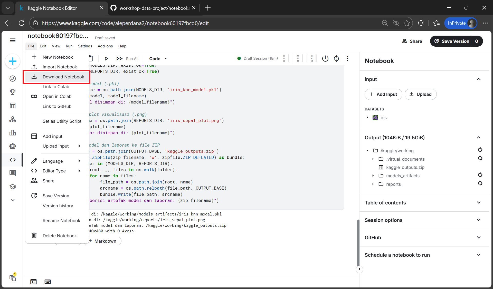
3. File `.ipynb` akan terunduh ke komputer Anda.

---

### B. Opsi 2: Push ke GitHub

Gunakan opsi ini untuk memperbarui repositori GitHub langsung dari Kaggle.

1. Klik menu **File** lalu tekan **Link to GitHub** untuk menghubungkan notebook dengan akun GitHub Anda.
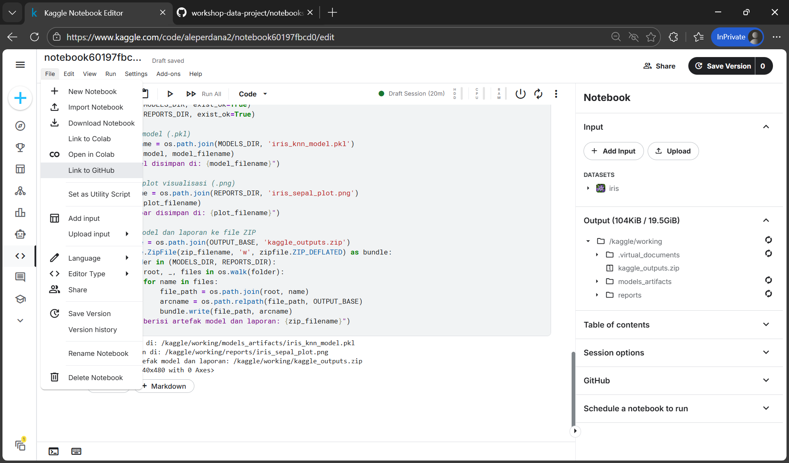
2. Setelah terhubung, klik **Save Version** → isi nama versi (opsional) dan pilih **Version Type** `Save & Run All (Commit)` → tekan **Continue**.
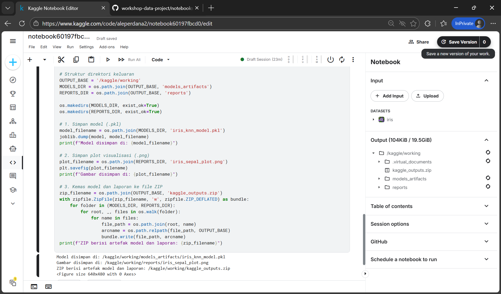
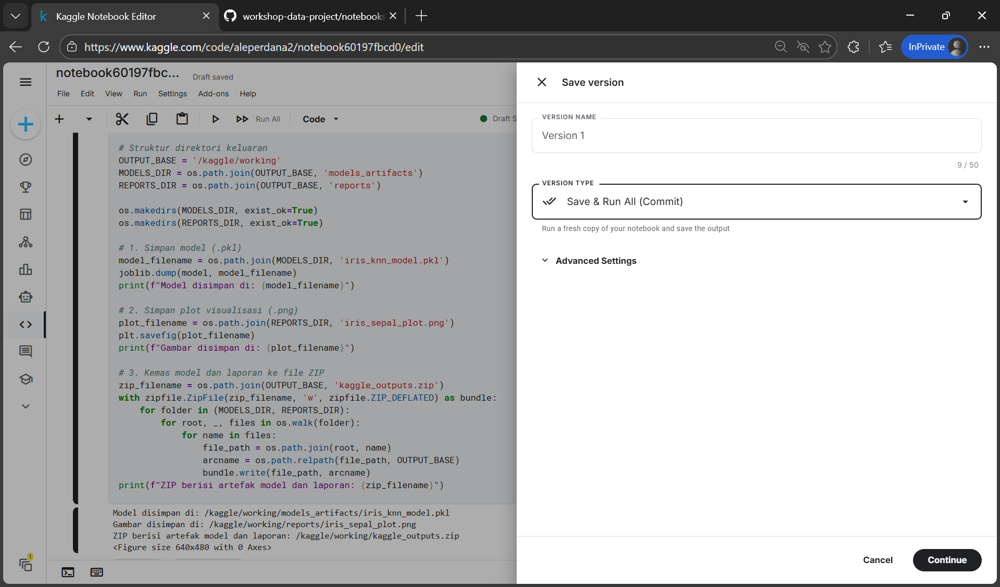
3. Pilih repositori dan branch tujuan.
4. Isi **File Name** sesuai standar penamaan proyek (misal `notebooks/01-iris-analysis.ipynb`).
5. Isi **Commit Message** sesuai konvensi conventional commit (misal `feat(notebook): add iris knn training`).
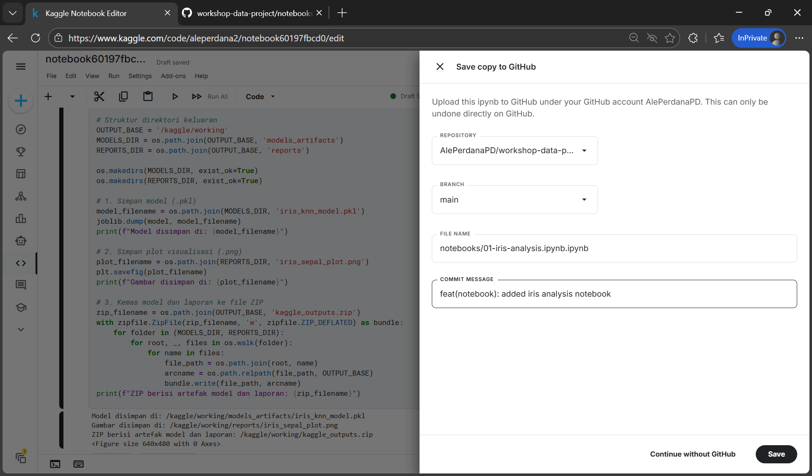
6. Tekan **Push** untuk memulai proses—Kaggle akan menjalankan notebook, lalu otomatis mendorong hasilnya ke GitHub ketika selesai.
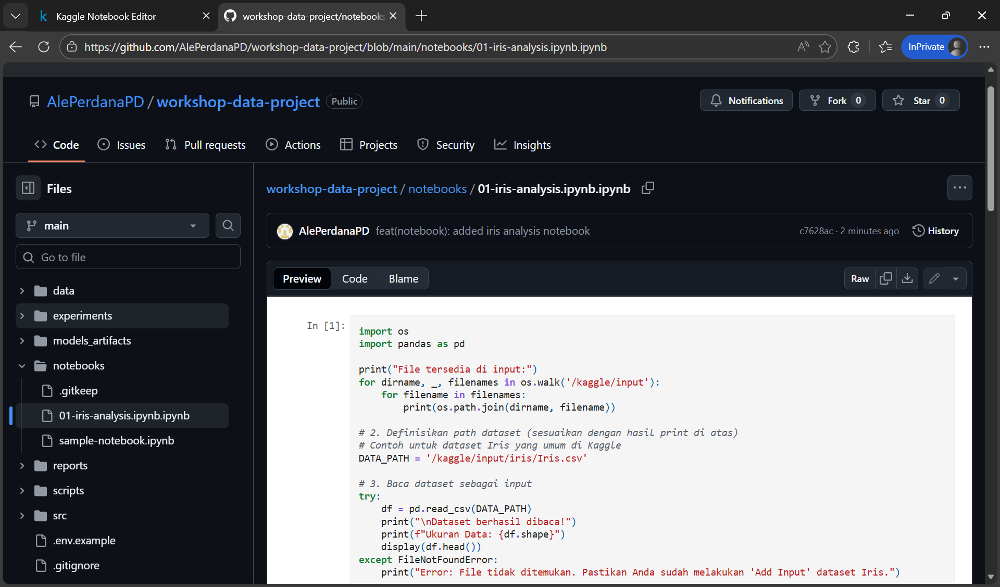

> **Catatan Tambahan:**  
> Untuk menjaga stabilitas, sebaiknya semua push notebook diarahkan ke **branch terpisah** yang telah dibuat terlebih dahulu di GitHub, bukan langsung ke `main`/branch utama. Setelah perubahan diverifikasi, baru lakukan merge/PR ke branch utama agar history tetap bersih.

### C. Opsi 3: Pull dari GitHub

Gunakan opsi ini untuk memperbarui notebook Anda dengan versi terbaru yang sudah ada di GitHub.

1. Di editor notebook, lihat panel kanan (sidebar).
2. Scroll ke bawah hingga menemukan bagian **GitHub**.
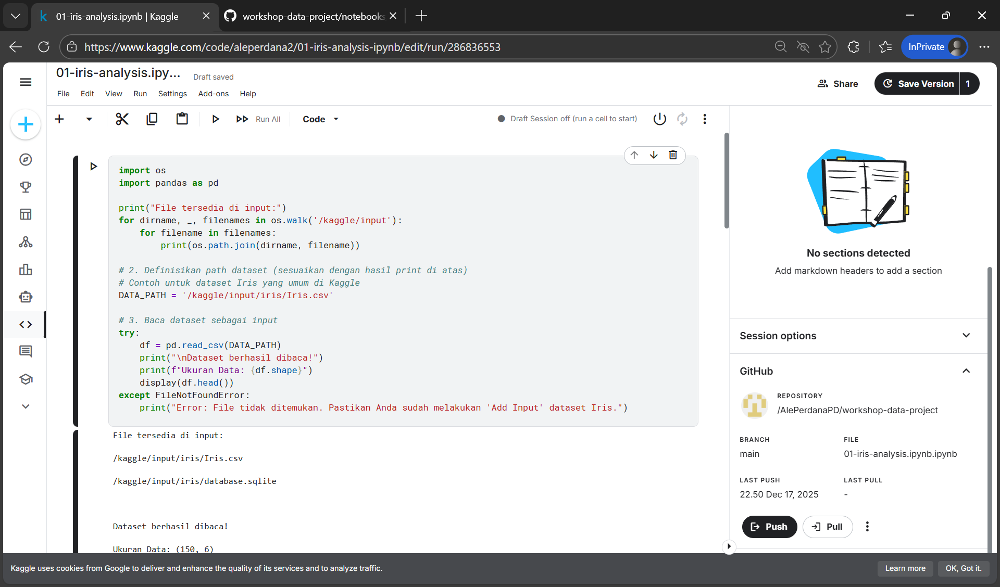
3. Tekan tombol **Pull**.
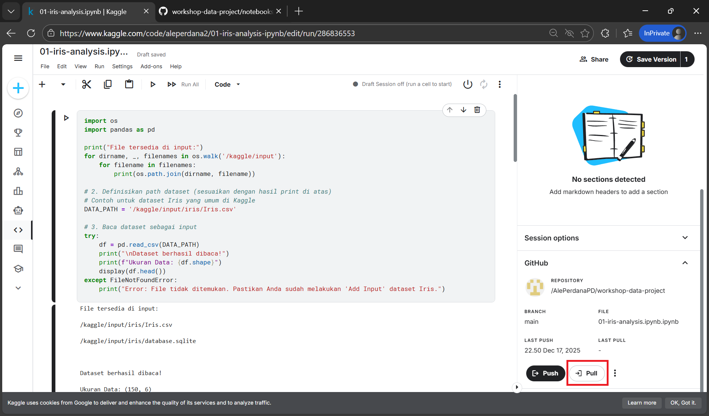
4. Pilih **Pull from GitHub** untuk menimpa notebook lokal Anda dengan versi terakhir dari repo.
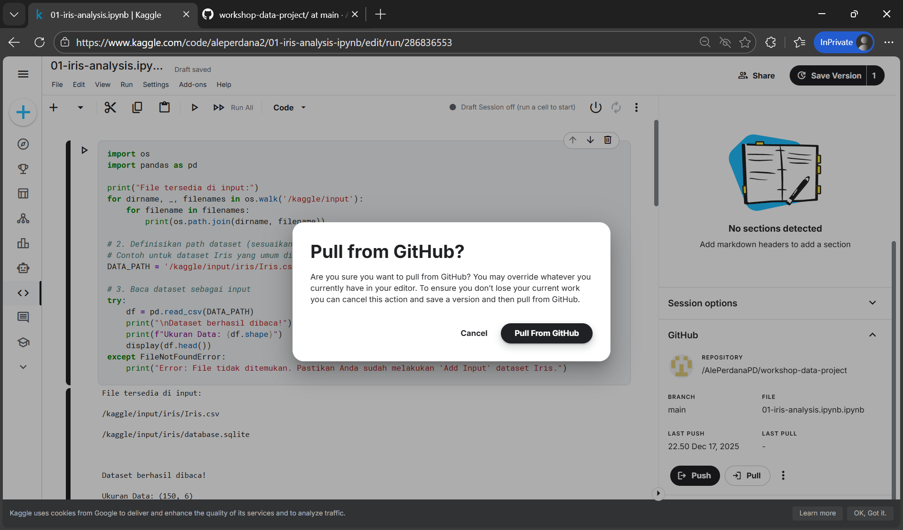
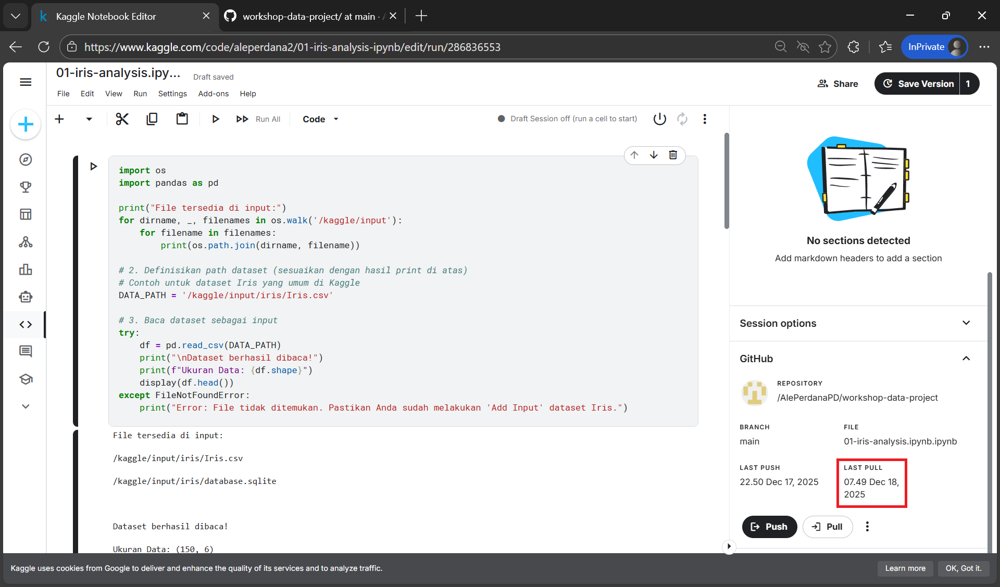

Opsi ini cocok ketika kolaborator sudah mendorong versi terbaru dan Anda ingin segera menyinkronkan kerja Anda.

---

## Langkah 3: Perbarui Dokumentasi di GitHub

Sekarang, kita sambungkan Kaggle ke GitHub.

### A. Edit `README.md` di Repositori
Tambahkan bagian baru:

```markdown
## Analisis & Insight

Notebook eksplorasi data lengkap tersedia di Kaggle:

- [EDA: Iris Species – Visualisasi & Storytelling](https://www.kaggle.com/username/nama-notebook)

### Ringkasan Insight
- Fitur petal sangat diskriminatif untuk membedakan spesies.
- Iris setosa terpisah sempurna dari versicolor & virginica.
- Tidak ada missing value → dataset siap untuk modeling.
```
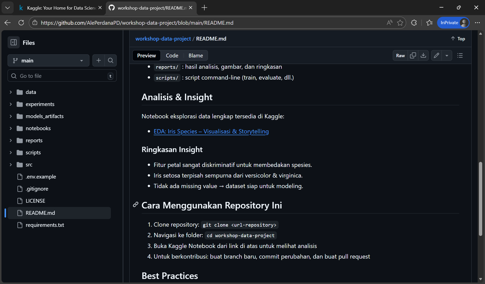

---

## Langkah 4: Review Struktur Proyek Akhir

Pastikan repositori memiliki:

```
nama-proyek/
│
├── README.md
├── LICENSE
├── .gitignore
├── .env.example
├── requirements.txt
│
├── data/
│   └── ...
│
├── notebooks/
│   └── ...
│
├── src/
│   ├── config/
│   │   └── ...
│   │
│   ├── data/
│   │   └── ...
│   │
│   ├── models/
│   │   └── ...
│   │
│   ├── pipelines/
│   │   └── ...
│   │
│   └── utils/
│       └── ...
│
├── experiments/
│   └── ...
│
├── models_artifacts/
│   └── ...
│
├── reports/
│   └── ...
│
└── scripts/
   └── ...
```

> **Catatan**:  
> Untuk penjelasan struktur proyek lengkap, silakan merujuk ke modul **1.02 Struktur Proyek Data** pada **Day 1**.

---

## Best Practices Integrasi

✅ **Gunakan README sebagai “pintu masuk”**:  
   - Jelaskan konteks, dataset, insight, dan link utama

✅ **Jaga konsistensi nama**:  
   - Nama notebook di Kaggle ≈ nama proyek di GitHub

✅ **Publikasikan hanya versi final**:  
   - Hindari mempublikasikan draft atau versi error

> 💡 Ingat:  
> **Publikasi = kontribusi ke komunitas!**  
> Orang lain bisa belajar dari analisis Anda.

---