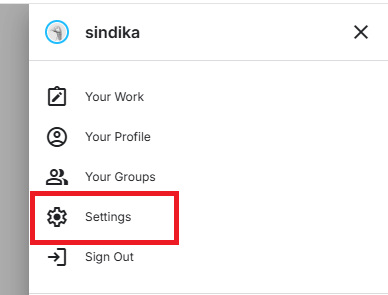
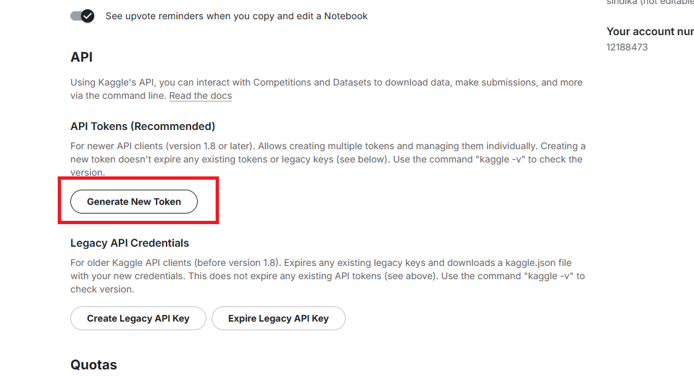
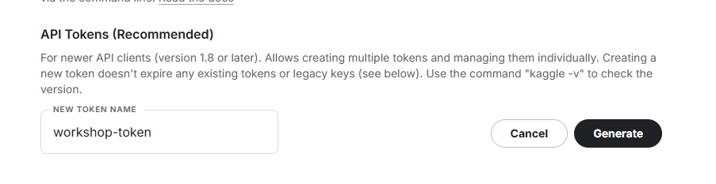
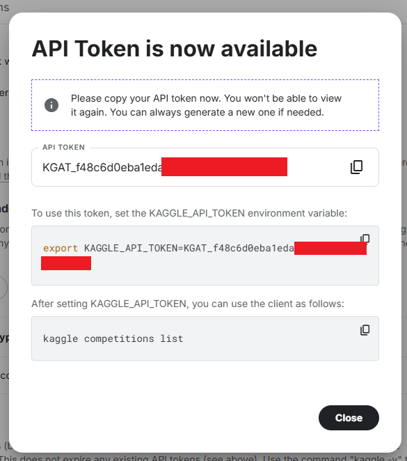

#  Kaggle API

## Tujuan Sesi

Setelah mengikuti sesi ini, peserta diharapkan mampu:

1. Memahami fungsi dan peran **Kaggle API** dalam workflow data science.
2. Membuat dan mengelola **Kaggle API Token** dengan benar dan aman.
3. Mengonfigurasi Kaggle API di berbagai lingkungan (Windows, Linux, macOS).
4. Mengunduh dataset dan data kompetisi Kaggle secara terprogram (CLI & script).
5. Mengintegrasikan Kaggle API ke dalam **struktur proyek data science yang rapi dan reproducible**.
6. Menghindari kesalahan umum terkait keamanan credential dan konfigurasi.

---

## 1. Prasyarat

Pastikan Anda sudah memiliki:

- Akun **Kaggle** (https://www.kaggle.com)
- **Python 3.8 atau lebih baru**
- Akses terminal / command prompt
- Koneksi internet

---

## 2. Membuat Kaggle API Token

Kaggle API menggunakan file `kaggle.json` sebagai **credential**.

### Langkah-langkah

1. Login ke akun **Kaggle**
2. Klik profile pada pojok kanan atas kemudian Masuk ke menu **Setting**
    
    
3. Scroll ke bagian **API**
4. Klik **Generate New Token** pada Scope API Token.
    
5. Masukkan nama token dan klik **Generate**
    
5. Copy API Token dan simpan untuk akses selanjutnya.
    
    
---

## 3. Instalasi Kaggle API Client


```bash
pip install kaggle
```

Verifikasi:

```bash
kaggle --version
```

---

## 4. Konfigurasi Kaggle API


### Opsi A — Konfigurasi Standar (Direkomendasikan)

#### Linux / macOS

```bash
mkdir -p ~/.kaggle
mv kaggle.json ~/.kaggle/
chmod 600 ~/.kaggle/kaggle.json
```

#### Windows (PowerShell)

```powershell
mkdir $env:USERPROFILE\.kaggle
move kaggle.json $env:USERPROFILE\.kaggle\
```

---

### Opsi B — Environment Variable (CI/CD)


```bash
export KAGGLE_USERNAME=username_kaggle_anda
export KAGGLE_KEY=api_key_kaggle_anda
```

---

## 5. Uji Konfigurasi


```bash
kaggle datasets list
```

---

## 6. Mengunduh Dataset


```bash
kaggle datasets list -s iris
kaggle datasets download -d uciml/iris --unzip
```

---

## 7. Mengunduh Data Kompetisi


```bash
kaggle competitions list
kaggle competitions download -c titanic --unzip
```

---

## 8. Integrasi ke Struktur Proyek


```
project/
├── data/
│   ├── raw/
│   └── processed/
├── scripts/
│   └── download_data.py
├── requirements.txt
├── .gitignore
└── README.md
```

---

## 9. .gitignore (Wajib)


```gitignore
.kaggle/
kaggle.json
```

---

## 10. Error Umum


- **403 Forbidden** → Token tidak valid
- **kaggle: command not found** → Python belum di PATH
- **Permission denied** → Perbaiki permission file

---

## 11. Ringkasan


| Tahap | Tujuan |
|------|--------|
| API Token | Autentikasi |
| Install CLI | Akses Kaggle |
| Konfigurasi | Keamanan |
| Download | Otomatisasi |
| Script | Reproducible |

---

