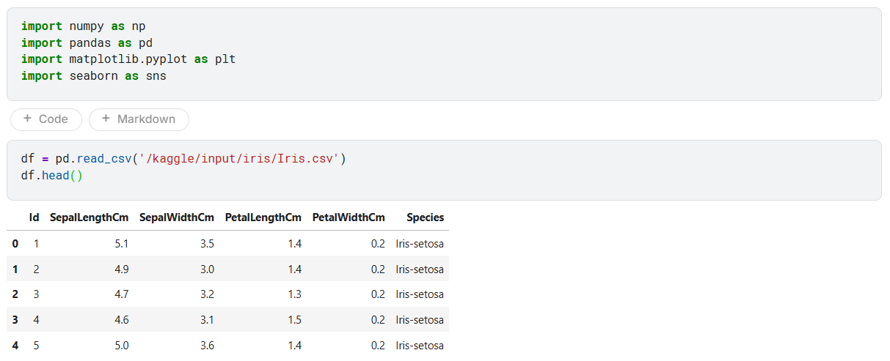
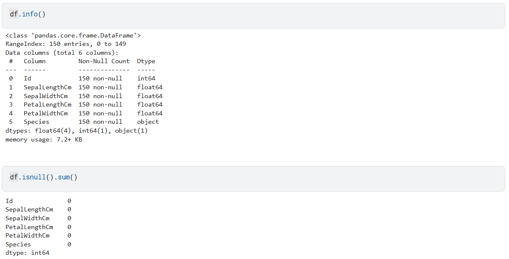
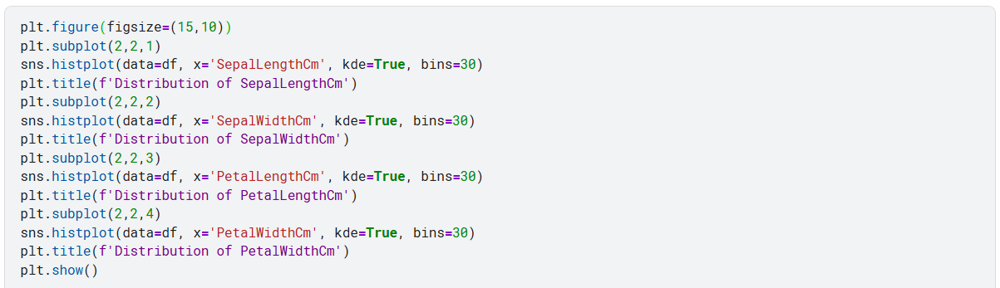

# Eksplorasi Data (EDA) dengan Dataset Iris  

## Apa Itu EDA?

> **EDA = Exploratory Data Analysis**  
> Artinya: *“Mengenal data sebelum menganalisis lebih jauh.”*

Bayangkan Anda baru kenal seseorang.  
Apa yang Anda lakukan?  
→ Tanya namanya, usia, pekerjaan, hobi…  
→ Lihat apakah ia ramah, serius, atau santai.

**EDA adalah cara kita “mengenal” dataset**:
- Apa isinya?
- Apakah datanya rapi?
- Ada pola menarik?
- Apa yang bisa kita pelajari sebelum bikin model?

> 🔍 Tujuan EDA:  
> - Cek kualitas data  
> - Temukan insight awal  
> - Tentukan arah analisis selanjutnya

---

## Kenalan dengan Dataset Iris

> **Dataset Iris** = kumpulan data ukuran bunga Iris dari 3 spesies:
> - *Iris setosa*
> - *Iris versicolor*
> - *Iris virginica*

Untuk tiap bunga, kita punya 4 ukuran (dalam cm):
- Panjang sepal (`SepalLengthCm`)
- Lebar sepal (`SepalWidthCm`)
- Panjang petal (`PetalLengthCm`)
- Lebar petal (`PetalWidthCm`)

Total: **150 bunga** → 50 per spesies.

---

## Langkah-Langkah EDA (Praktik di Kaggle Notebook)

### Langkah 1: Muat Data & Lihat Sekilas

```python
import pandas as pd
df = pd.read_csv('/kaggle/input/iris/Iris.csv')
df.head()
```



**Penjelasan:**
- `pd.read_csv(...)` → memuat file CSV ke dalam bentuk tabel (disebut **DataFrame**)
- `df.head()` → tampilkan **5 baris pertama** agar kita tahu struktur data

---

### Langkah 2: Periksa Kualitas Data

```python
df.info()
df.isnull().sum()
```



**Penjelasan:**
- `df.info()` → tunjukkan:
  - Jumlah baris & kolom
  - Tipe data tiap kolom (angka? teks?)
  - Apakah ada data kosong?
- `df.isnull().sum()` → hitung **jumlah nilai kosong** di tiap kolom

---

### Langkah 3: Statistik Ringkas

```python
df.describe().T
```


**Penjelasan:**
- `df.describe()` → tampilkan **statistik dasar** tiap kolom angka:
  - Rata-rata (mean)
  - Nilai minimum & maksimum
  - Standar deviasi (seberapa tersebar datanya)
- `.T` → “transpose” → ubah baris jadi kolom biar lebih mudah dibaca

---

### Langkah 4: Buang Kolom yang Tidak Perlu

```python
df = df.drop(columns='Id')
```


**Penjelasan:**
- Kolom `Id` hanya nomor urut → **tidak membantu analisis**
- Kita hapus biar fokus pada fitur yang relevan

---

### Langkah 5: Lihat Distribusi Tiap Fitur

```python
import seaborn as sns
import matplotlib.pyplot as plt

plt.figure(figsize=(15,10))
sns.histplot(data=df, x='SepalLengthCm', kde=True)
# ... (ulangi untuk 3 fitur lain)
plt.show()
```



**Penjelasan:**
- `histplot` → gambar **histogram**: sebaran nilai suatu fitur
- `kde=True` → tambahkan garis halus yang tunjukkan pola distribusi
- Kita lihat: apakah datanya menyebar merata? Ada puncak? Ada outlier?

> 🔍 Contoh insight:  
> - `PetalLengthCm` punya **dua puncak** → kemungkinan ada **dua kelompok spesies** yang berbeda!

---

### Langkah 6: Bandingkan Antar Fitur & Spesies

```python
sns.scatterplot(
    data=df, 
    x='PetalLengthCm', 
    y='PetalWidthCm', 
    hue='Species'
)
```


**Penjelasan:**
- `scatterplot` → titik-titik yang memetakan dua fitur sekaligus
- `hue='Species'` → warna titik berbeda berdasarkan spesies

> 🎯 Ini adalah **kunci utama EDA Iris!**  
> Hasilnya:  
> - *Setosa* → kelompok terpisah sempurna  
> - *Versicolor* & *Virginica* → tumpang tindih sedikit  
> ➡️ Artinya: **fitur petal sangat kuat untuk membedakan spesies!**

---

### Langkah 7: Cek Hubungan Antar Fitur (Korelasi)

```python
X = df.drop(columns='Species')
sns.heatmap(X.corr(), annot=True)
```


**Penjelasan:**
- `X.corr()` → hitung **korelasi** antar fitur (seberapa mirip pola perubahan mereka)
- `heatmap` → visualisasi warna: merah = sangat berkaitan, biru = kurang berkaitan
- `annot=True` → tampilkan angka di tiap sel

> 🔗 Temuan:  
> - `PetalLength` & `PetalWidth` → **sangat berkorelasi (0.96)**  
> Artinya: bunga dengan petal panjang biasanya juga lebar.
