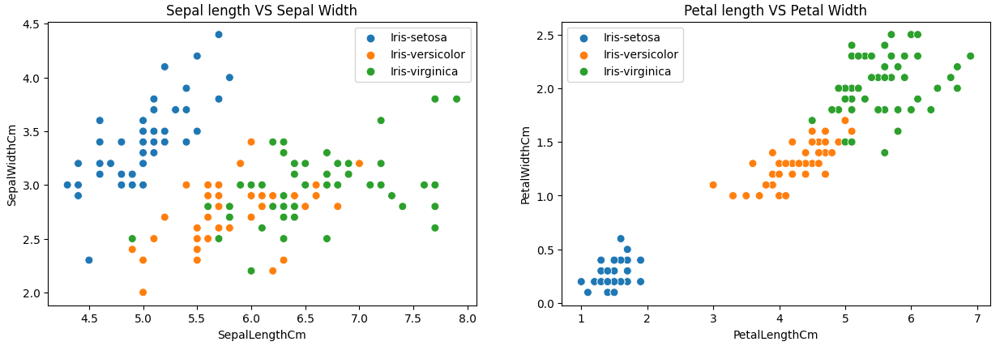
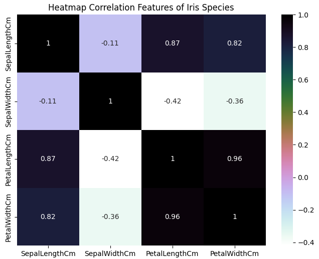
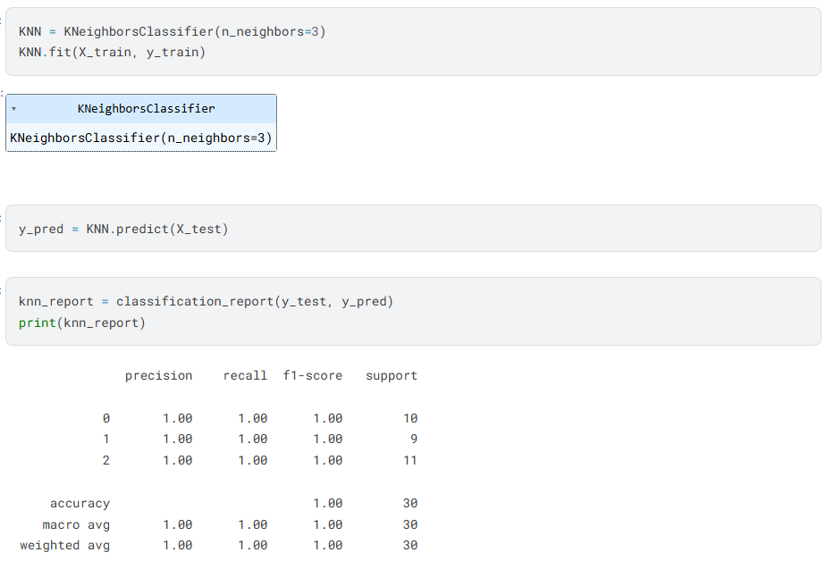
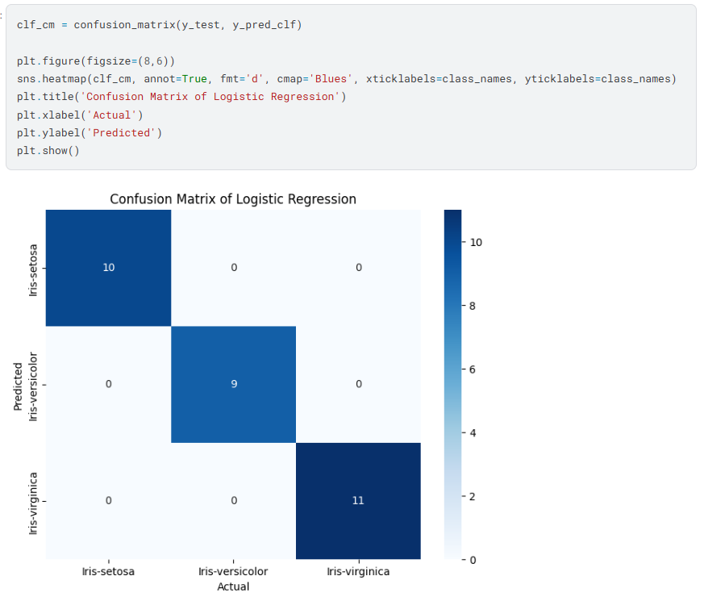

# Storytelling Data: Menyampaikan Insight dari Analisis

## Tujuan Sesi
- Memahami mengapa **storytelling** penting dalam proyek data  
- Belajar menyusun alur cerita dari eksplorasi data  
- Mengubah hasil EDA menjadi **narasi yang jelas dan menarik** di Kaggle Notebook  
- Menyusun dokumentasi yang bisa dipahami oleh **non-teknis (stakeholder)**

---

## Mengapa Storytelling Itu Penting?

> **Data tanpa cerita = angka yang terlupakan.**

Bayangkan Anda menemukan:
> “Petal length dan width sangat membedakan spesies Iris.”

Tapi Anda hanya kirim grafik ke atasan →  
➡️ Mereka mungkin tidak paham **kenapa ini penting**.

Sekarang, bayangkan Anda berkata:
> “Kita bisa mengidentifikasi spesies bunga hanya dari ukuran kelopaknya — tanpa melihat bentuk bunganya! Ini berarti sistem otomatis berbasis kamera bisa dikembangkan untuk klasifikasi tanaman.”

➡️ **Sekarang itu bernilai bisnis!**

> 🎯 Tujuan storytelling:  
> **Jembatani** antara teknis (analisis) dan non-teknis (keputusan).

---

## Elemen Dasar Storytelling Data

Setiap cerita data yang baik punya **3 bagian**:

### 1. **Masalah / Konteks**
> “Apa yang ingin kita pahami?”  
Contoh:  
> _“Bagaimana membedakan tiga spesies bunga Iris berdasarkan ukuran morfologisnya?”_

### 2. **Eksplorasi & Temuan**
> “Apa yang kita temukan dari data?”  
Contoh:  
> _“Fitur petal (kelopak) jauh lebih informatif daripada sepal (kelopak luar).”_  
> _“Spesies *Iris setosa* terpisah sempurna dari yang lain.”_

### 3. **Kesimpulan**
> “Jadi, apa artinya ini?”  
Contoh:  
> _“**Iris setosa** bisa diidentifikasi dengan mudah, sementara versicolor dan virginica butuh analisis lebih halus.”_

---

## Praktik: Bangun Cerita dari EDA Iris

### Langkah 1: Penjelasan Tentang Dataset yang Digunakan
```markdown
### 1. Tentang Dataset Iris Species

Dataset Iris (atau dikenal juga sebagai *Iris flower dataset*) adalah salah satu dataset paling terkenal dalam dunia ilmu data dan pembelajaran mesin. Dataset ini pertama kali diperkenalkan oleh ahli biologi statistik Ronald Fisher pada tahun 1936 untuk mengilustrasikan teknik klasifikasi.

Dataset ini berisi 150 sampel bunga Iris, yang terbagi rata menjadi 3 spesies:
- *Iris setosa*
- *Iris versicolor*
- *Iris virginica*

Untuk setiap bunga, terdapat 4 fitur pengukuran numerik:
- **SepalLengthCm**: panjang sepal (cm)
- **SepalWidthCm**: lebar sepal (cm)
- **PetalLengthCm**: panjang petal (cm)
- **PetalWidthCm**: lebar petal (cm)

Tujuan utama dari dataset ini biasanya adalah untuk mengklasifikasikan spesies bunga berdasarkan keempat fitur tersebut. Namun, dalam proyek ini, kita akan fokus pada Exploratory Data Analysis (EDA) untuk memahami pola, distribusi, dan hubungan antar variabel dalam data.
```

### Langkah 2: Pembersihan Data


```markdown
### Penjelasan

**Link dataset**: [Iris Dataset on Kaggle](https://www.kaggle.com/datasets/uciml/iris )

Dataset ini memiliki 6 kolom awal, namun kita fokus pada 5 kolom utama setelah preprocessing:

1. **Id**: Nomor urut sampel → *tidak relevan untuk analisis, dihapus.*
2. **SepalLengthCm**: Panjang sepal (cm)
3. **SepalWidthCm**: Lebar sepal (cm)
4. **PetalLengthCm**: Panjang petal (cm)
5. **PetalWidthCm**: Lebar petal (cm)
6. **Species**: Spesies bunga (*Iris-setosa*, *Iris-versicolor*, *Iris-virginica*)


### Apa yang dapat kita pahami dari data ini:

- Dataset berisi 150 baris dan 6 kolom awal.
- Tidak ada nilai null.
- Semua fitur numerik memiliki distribusi yang bisa dieksplorasi lebih lanjut.
- Kolom `Id` tidak memberikan informasi prediktif → dihapus.
- Statistik deskriptif menunjukkan variasi yang signifikan antar fitur — misalnya, panjang petal lebih bervariasi dibanding lebar sepal.
- Target (`Species`) adalah kategorikal dengan 3 kelas seimbang (50 sampel per spesies).
```

### Langkah 3: Penjelasan Tentang EDA
```markdown
### 3. Apa Itu Exploratory Data Analysis (EDA)?

**Exploratory Data Analysis (EDA)** adalah proses menganalisis dan memvisualisasikan data untuk:
- Memahami struktur dan kualitas data
- Menemukan pola, tren, atau hubungan antar variabel
- Mendeteksi outlier (data tidak biasa) atau nilai yang hilang
- Menentukan langkah selanjutnya dalam analisis atau pemodelan

Dalam konteks dataset Iris, EDA akan membantu kita menjawab pertanyaan seperti:
- Bagaimana distribusi panjang dan lebar sepal/petal di tiap spesies?
- Apakah ada perbedaan yang jelas antar spesies berdasarkan fitur-fitur tersebut?
- Fitur mana yang paling membedakan satu spesies dari yang lain?

EDA biasanya melibatkan:
- **Statistik deskriptif** (misalnya: rata-rata, median, rentang nilai)
- **Visualisasi data** seperti histogram, boxplot, scatter plot, dan pairplot
```

### 🖼️ Grafik 1: Distribusi Fitur (Histogram)


> **Penjelasan untuk notebook (copy-paste ke cell markdown di bawah grafik):**

```markdown
### Penjelasan

Berikut adalah histogram dari keempat fitur numerik dataset Iris, lengkap dengan kurva densitas (KDE) untuk melihat bentuk distribusi datanya:

-  **SepalLengthCm**:  
  Distribusi cenderung normal, berkisar antara 4.5–8.0 cm. Mayoritas bunga memiliki panjang sepal sekitar 5.5–6.5 cm.

-  **SepalWidthCm**:  
  Distribusi sedikit miring ke kiri, dengan nilai dominan di sekitar 2.8–3.5 cm. Ada sedikit outlier di atas 4.0 cm.

-  **PetalLengthCm**:  
  Distribusi bimodal, artinya ada dua kelompok utama: satu di sekitar 1.5 cm (kemungkinan *Iris-setosa*) dan satu lagi di 4.5–5.5 cm (spesies lain). Ini menunjukkan bahwa petal length sangat membedakan spesies.

-  **PetalWidthCm**:  
  Juga bimodal, dengan puncak pertama di ~0.2 cm (setosa) dan puncak kedua di 1.0–2.0 cm (versicolor & virginica). Sangat berguna untuk klasifikasi.

>  **Insight penting**:  
Fitur petal (panjang & lebar) jauh lebih membedakan antar spesies dibanding sepal, karena distribusinya lebih terpisah dan sering menunjukkan pola bimodal.
```

---

### 📈 Grafik 2: Scatter Plot (Perbandingan Fitur)



> **Penjelasan untuk notebook (copy-paste ke cell markdown di bawah grafik):**

```markdown
### Penjelasan

Visualisasi Scatter Plot: hubungan antar fitur per spesies ini membandingkan dua pasang fitur:

-  **Sepal Length VS Sepal Width**:  
  - Titik-titik dari ketiga spesies tumpang tindih cukup banyak, terutama antara *versicolor* dan *virginica*.  
  - *Setosa* agak terpisah, tapi tidak sepenuhnya.  
  → Menunjukkan bahwa sepal saja kurang memadai untuk membedakan spesies secara akurat.

-  **Petal Length VS Petal Width**:  
  - Pola sangat jelas:  
    - *Iris-setosa* (biru) terpisah jauh di kiri bawah (petal kecil).  
    - *Iris-versicolor* (orange) berada di tengah.  
    - *Iris-virginica* (hijau) tersebar di kanan atas (petal lebih besar).  
  → Fitur petal sangat kuat untuk membedakan spesies, hampir sempurna terpisah.

-  **Insight utama**:  
  >  **Petal length dan petal width adalah fitur paling diskriminatif** untuk klasifikasi spesies Iris.  
  Sementara sepal lebih bersifat umum dan kurang membedakan.
```

---

### 🔗 Grafik 3: Heatmap Korelasi



> **Penjelasan untuk notebook (copy-paste ke cell markdown di bawah grafik):**

```markdown
### Penjelasan

Visualisasi ini menunjukkan kuatnya hubungan linier antar fitur numerik* menggunakan koefisien korelasi Pearson (skala -1 hingga +1):

-  **PetalLengthCm & PetalWidthCm**:  
  → Korelasi sangat tinggi: **0.96**  
  → Artinya, semakin panjang petal, semakin lebar pula — sangat berkaitan erat.

-  **SepalLengthCm & PetalLengthCm**:  
  → Korelasi kuat: **0.87**  
  → Panjang sepal cenderung sejalan dengan panjang petal.

-  **SepalLengthCm & PetalWidthCm**:  
  → Korelasi cukup tinggi: **0.82**  
  → Menunjukkan pola konsisten antara ukuran sepal dan petal.

-  **SepalWidthCm & lainnya**:  
  → Semua korelasinya lemah hingga negatif (misal: -0.11, -0.42, -0.36)  
  → Artinya, lebar sepal tidak banyak berhubungan dengan fitur lain — bisa jadi kurang penting untuk model prediktif.

-  Tidak ada korelasi negatif yang signifikan, semua hubungan bersifat positif atau netral.

>  **Insight utama**:  
Fitur petal (panjang & lebar) saling berkorelasi tinggi dan juga berkorelasi kuat dengan panjang sepal — menunjukkan bahwa mereka membawa informasi serupa yang sangat berguna untuk klasifikasi.
```

---

### 🎭 Grafik 4: Violin Plot (Per Spesies)


> **Penjelasan untuk notebook (copy-paste ke cell markdown di bawah grafik):**

```markdown
### Penjelasan

Visualisasi ini menunjukkan distribusi dan spread nilai setiap fitur, dibagi berdasarkan spesies (*Iris-setosa*, *Iris-versicolor*, *Iris-virginica*). Bentuk violin menggambarkan densitas data, sementara garis tengah menunjukkan median:

-  **PetalLengthCm**:  
  → *Setosa*: sangat pendek (1.0–2.0 cm)  
  → *Versicolor*: sedang (3.5–5.0 cm)  
  → *Virginica*: paling panjang (4.5–7.0 cm)  
  → Sangat terpisah, fitur terbaik untuk membedakan spesies!

-  **PetalWidthCm**:  
  → Pola serupa dengan petal length: *setosa* sangat sempit, *virginica* paling lebar.  
  → Korelasi tinggi antara panjang & lebar petal terkonfirmasi secara visual.

-  **SepalLengthCm**:  
  → *Setosa* cenderung lebih pendek, tapi tumpang tindih dengan *versicolor*.  
  → *Virginica* paling panjang, tapi masih ada overlap.  
  → Kurang membedakan dibanding petal.

-  **SepalWidthCm**:  
  → *Setosa* cenderung lebih lebar, tapi distribusinya tumpang tindih banyak dengan dua spesies lain.  
  → Paling kurang membedakan, bisa jadi fitur paling lemah untuk klasifikasi.

>  **Insight utama**:  
Fitur petal (panjang & lebar) menunjukkan pemisahan yang sangat jelas antar spesies, sementara sepal (terutama lebar) relatif tumpang tindih dan kurang informatif.
```

---

### Langkah 4: Model Training and Evaluation


### K-Nearest Neighbors




```markdown
###  Pelatihan dan Evaluasi Model KNN pada Dataset Iris

Model **K-Nearest Neighbors (KNN)** dengan `k=3` dilatih menggunakan data latih yang telah dibagi sebelumnya (80% dari dataset). Setelah pelatihan, model digunakan untuk memprediksi spesies bunga pada data uji (20% sisanya). Hasil prediksi kemudian dievaluasi menggunakan dua metode utama: **classification report** dan **confusion matrix**.

Evaluasi menunjukkan performa yang sempurna:  
- **Akurasi = 100%**  
- Semua nilai **precision**, **recall**, dan **f1-score** bernilai **1.00** untuk ketiga kelas (*Iris-setosa*, *Iris-versicolor*, *Iris-virginica*)  
- Confusion matrix tidak menunjukkan satupun kesalahan klasifikasi — semua 30 sampel data uji diprediksi dengan benar  

Hal ini terjadi karena dataset Iris bersifat sangat terpisah secara spasial, terutama berkat fitur *petal length* dan *petal width* yang membedakan ketiga spesies dengan jelas.
```

### Logistic Regression




```markdown
### Pelatihan dan Evaluasi Model Logistic Regression pada Dataset Iris

Model **Logistic Regression** dilatih menggunakan data latih yang telah dibagi sebelumnya (80% dari dataset). Meskipun termasuk model linier dan biasanya digunakan untuk klasifikasi biner, versi multinomial dari Logistic Regression mampu menangani tiga kelas spesies bunga Iris secara efektif. Setelah pelatihan, model digunakan untuk memprediksi spesies pada data uji (20% sisanya), dan hasil prediksi dievaluasi menggunakan **classification report** dan **confusion matrix**.

Evaluasi menunjukkan performa yang sempurna:  
- **Akurasi = 100%**  
- Semua nilai **precision**, **recall**, dan **f1-score** bernilai **1.00** untuk ketiga kelas (*Iris-setosa*, *Iris-versicolor*, *Iris-virginica*)  
- Confusion matrix tidak menunjukkan satupun kesalahan klasifikasi — semua 30 sampel data uji diprediksi dengan benar 
```

### Langkah 5: Akhiri dengan Bagian Kesimpulan  
> Di akhir notebook, tambahkan satu cell markdown berjudul **Kesimpulan**:

```markdown
### 5. Kesimpulan Perbandingan Model: KNN vs Logistic Regression

Baik model **K-Nearest Neighbors (KNN)** maupun **Logistic Regression** berhasil mencapai **akurasi 100%** pada dataset Iris, dengan semua metrik evaluasi (precision, recall, f1-score) bernilai sempurna untuk ketiga kelas spesies. Ini menunjukkan bahwa kedua model mampu mengklasifikasikan semua sampel data uji tanpa kesalahan.

Perbedaan utamanya terletak pada pendekatan:  
- **KNN** adalah model *non-parametrik* yang mengandalkan kemiripan jarak antar data.  
- **Logistic Regression** adalah model *linier parametrik* yang mempelajari batas keputusan berbentuk garis lurus (atau hyperplane).

Namun, karena struktur dataset Iris yang sangat terpisah secara linear, terutama berkat fitur petal yang membentuk kelompok jelas, bahkan model linier sederhana seperti Logistic Regression pun mampu bekerja optimal.
```

---

## Tips Menulis Cerita Data yang Baik

✅ **Gunakan bahasa sehari-hari** — hindari jargon teknis jika tidak perlu  
✅ **Mulai dari “kenapa”**, bukan “bagaimana”  
✅ **Satu insight = satu paragraf**  
✅ **Highlight angka penting**:  
   > “Korelasi antara panjang dan lebar petal mencapai **0.96** — hampir sempurna!”  
✅ **Gunakan bold atau bullet** untuk penekanan

> ❌ Jangan tulis:  
> “Berikut adalah heatmap korelasi.”  
>  
> ✅ Tulis:  
> “Panjang dan lebar petal sangat berkaitan — artinya, bunga dengan petal panjang cenderung juga lebar.”

---