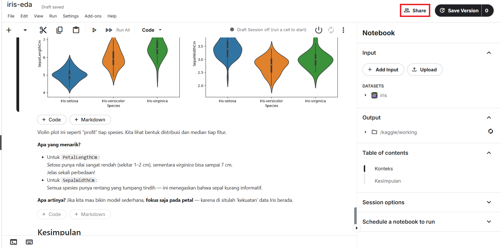

# Review & Kolaborasi dalam Proyek Data

## Tujuan Sesi
- Memahami **pentingnya review sebelum publikasi**
- Melatih **peer review** terhadap notebook dan dokumentasi teman
- Memberikan umpan balik yang **konstruktif, spesifik, dan membantu**
- Menyiapkan bahan (notebook & README) agar **siap untuk integrasi di sesi berikutnya**

> ⏳ **Catatan penting**:  
> Publikasi resmi dan integrasi link GitHub–Kaggle **belum final di sesi ini**.  
> Tapi agar bisa direview, **notebook harus sementara diubah ke *public***.

---

## Mengapa Review Itu Penting?

> **“Kode dan analisis yang tidak direview = berisiko salah dipahami.”**

Di dunia nyata:
- Data scientist **selalu bekerja dalam tim**
- Analisis harus **bisa dipahami orang lain**, bukan hanya diri sendiri
- Kesalahan kecil (misal: label grafik hilang, typo di README) bisa menyesatkan

---

## Apa yang Akan Kita Review Hari Ini?

Karena sesi **Publikasi & Integrasi** belum dimulai, kita akan mereview **draft** yang sudah dibuat di sesi sebelumnya:

### 1. **Kaggle Notebook (draft)**
- Sudah berisi EDA lengkap (histogram, scatter plot, heatmap, dll.)
- Sudah diperkaya dengan **storytelling** (penjelasan di markdown)
- **Akan diubah ke *public*** agar bisa direview

### 2. **Repository GitHub (draft)**
- Struktur dasar: `data/`, `notebooks/`, `README.md`
- `README.md` berisi:
  - Konteks proyek
  - Deskripsi dataset
  - Insight awal (boleh masih singkat)
- **Belum ada link ke notebook** (akan ditambahkan di sesi berikutnya)

---

## Langkah-Langkah Review (Berpasangan)

### Langkah 1: Siapkan Notebook untuk Review oleh pasangan:
1. Buka notebook Anda di Kaggle
2. Klik tombol **Share** di kanan atas

3. Pilih **“Public”**
4. Salin **URL notebook publik** (misal: `https://www.kaggle.com/username/nama-notebook`)
5. Kemudian save

> 🔒 Jangan khawatir:  
> Anda bisa mengubahnya kembali ke *private* setelah sesi jika ingin.  
> Tapi untuk workshop ini, kami **mendorong publikasi** sebagai bagian dari pembelajaran!

### Langkah 2: Tukar Link dengan Pasangan
- Berikan:
  - Link **repo GitHub** Anda
  - Link **notebook Kaggle publik** Anda
- Terima link yang sama dari pasangan

### Langkah 3: Review Notebook Kaggle
Periksa:
- [ ] Apakah setiap visualisasi punya **penjelasan dalam markdown**?
- [ ] Apakah cerita mengalir: **konteks → temuan → kesimpulan**?
- [ ] Apakah bahasanya **mudah dipahami oleh orang non-teknis**?
- [ ] Apakah ada **typo, grafik tanpa judul, atau kode error**?

### Langkah 4: Review Repository GitHub
Periksa:
- [ ] Apakah struktur proyek **konsisten** dengan template?
- [ ] Apakah `README.md` menjelaskan:
  - **Apa** proyek ini?
  - **Dataset** apa yang dipakai?

---

## Cara Memberikan Umpan Balik yang Baik

> ❌ Jangan:  
> “Ini kurang jelas.”  
>  
> ✅ Lakukan:  
> “Bagian ini bagus! Mungkin bisa ditambahkan: **apa arti dari pemisahan sempurna Iris setosa?**”

### Gunakan Template:
1. **Apa yang sudah bagus?** → apresiasi dulu!
2. **Apa yang bisa diperbaiki?** → spesifik & solutif
3. **Pertanyaan klarifikasi** → jika ada yang tidak jelas

Contoh:
> “Scatter plot-nya sangat jelas! Tapi mungkin bisa ditambahkan kalimat:  
> *‘Karena Iris setosa terpisah sempurna, model klasifikasi bisa mencapai akurasi 100% untuk spesies ini.’*”

---