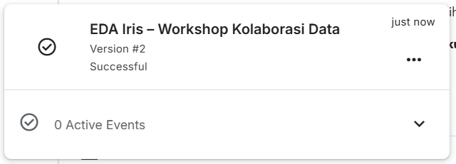
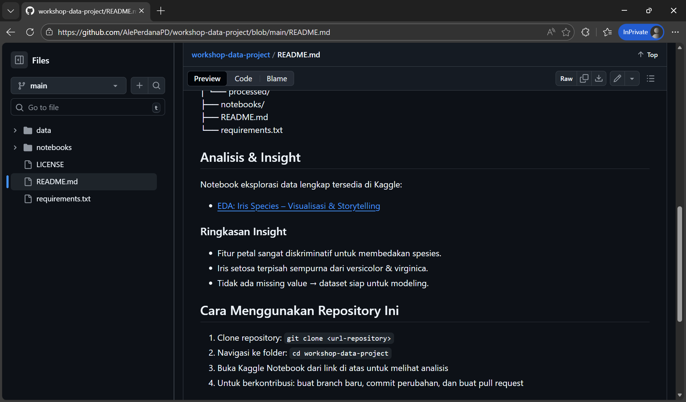

# Publikasi & Integrasi GitHub–Kaggle

## Tujuan Sesi
- Memahami alur **publikasi notebook** di Kaggle  
- Menyambungkan hasil analisis di Kaggle dengan **dokumentasi di GitHub**  
- Menghasilkan **proyek data terdokumentasi dan dapat diakses publik**  
- Menyiapkan template kolaboratif yang siap digunakan kembali

---

## Mengapa Integrasi GitHub–Kaggle Penting?

> **Kaggle** = tempat menganalisis dan bereksperimen  
> **GitHub** = tempat menyimpan, mendokumentasi, dan berkolaborasi  

Tanpa integrasi:
- Analisis hanya ada di Kaggle → sulit dilacak oleh tim di GitHub  
- Dokumentasi di GitHub tidak mencerminkan hasil nyata

Dengan integrasi:
- Siapa pun bisa **membaca insight** di GitHub  
- Sekaligus **melihat kode & visualisasi** langsung di Kaggle  
- Proyek jadi **reproducible, transparan, dan profesional**

> 🎯 Prinsip kolaborasi modern:  
> **“Satu proyek, dua platform — masing-masing memainkan perannya.”**

---

## Langkah 1: Publikasikan Notebook di Kaggle

### A. Simpan Versi Terakhir
1. Pastikan semua cell sudah dijalankan (lihat tanda ▶️ biru)
2. Klik **Save Version** → pilih **Save & Run All (Commit)**


3. Tunggu proses selesai (±2–5 menit)



### B. Ubah ke Status Publik
1. Setelah selesai, Buka notebook Anda di Kaggle
2. Klik tombol **Share** di kanan atas


3. Pilih **“Public”**
4. Salin **URL notebook publik** (misal: `https://www.kaggle.com/username/nama-notebook`)
5. Kemudian save

> ✅ Pastikan:
> - Judul jelas (misal: `EDA Iris – Workshop Kolaborasi Data`)
> - Deskripsi singkat di bagian atas notebook
> - Semua visualisasi muncul dengan baik

---

## Langkah 2: Perbarui Dokumentasi di GitHub

Sekarang, kita sambungkan Kaggle ke GitHub.

### A. Edit `README.md` di Repositori
Tambahkan bagian baru:

```markdown
## Analisis & Insight

Notebook eksplorasi data lengkap tersedia di Kaggle:

- [EDA: Iris Species – Visualisasi & Storytelling](https://www.kaggle.com/username/nama-notebook)

### Ringkasan Insight
- Fitur petal sangat diskriminatif untuk membedakan spesies.
- Iris setosa terpisah sempurna dari versicolor & virginica.
- Tidak ada missing value → dataset siap untuk modeling.
```


---

## Langkah 3: Review Struktur Proyek Akhir

Pastikan repositori memiliki:

```
workshop-data-project/
├── data/
│   ├── raw/.gitkeep
│   └── processed/.gitkeep
├── notebooks/
│   └── (catatan manual opsional)
├── images/               ← opsional, untuk screenshot
├── README.md             ← sudah berisi link ke Kaggle + insight
├── LICENSE               ← misal: MIT, jika ada..
└── requirements.txt      ← jika ada dependensi
```

---

## Best Practices Integrasi

✅ **Jangan duplikasi kode**:  
   - Jangan salin seluruh notebook ke GitHub  
   - Cukup tautkan ke Kaggle

✅ **Gunakan README sebagai “pintu masuk”**:  
   - Jelaskan konteks, dataset, insight, dan link utama

✅ **Jaga konsistensi nama**:  
   - Nama notebook di Kaggle ≈ nama proyek di GitHub

✅ **Publikasikan hanya versi final**:  
   - Hindari mempublikasikan draft atau versi error

> 💡 Ingat:  
> **Publikasi = kontribusi ke komunitas!**  
> Orang lain bisa belajar dari analisis Anda.

---